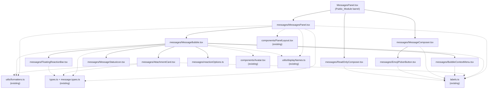

# Design Document

## Overview

This design splits the 1,500-line `MessagesPanel.tsx` Source_File into ten focused files under a new `messages/` subfolder, while keeping the original module path as a thin re-export barrel. The refactor is **purely structural** and **behavior-preserving**: every component definition, prop type, JSX subtree, Tailwind class, `aria-*` attribute, `lucide-react` icon, `@floating-ui/react` configuration, and side-effecting helper (network fetch in `AttachmentCard`, microphone access in `MessageComposer`, etc.) is relocated verbatim with only indentation adjustments.

The design satisfies four guarantees, in priority order:

1. **Public API parity** (Requirement 1) — `MessagesPanel`, `MessageComposer`, `ReadOnlyComposer` remain importable from `@/features/communication/conversations_redesign/components/MessagesPanel` with identical signatures, so `ConversationDetail.tsx` does not change.
2. **One component per file** (Requirements 2 and 3) — each of the ten units gets its own file with a named export matching its current identifier.
3. **Behavior parity** (Requirement 4) — JSX, hook order, popover configuration, callbacks, and DOM output are preserved verbatim.
4. **Clean import graph** (Requirement 5) — every file imports only what it uses, every used identifier is imported, no circular dependencies, all `@floating-ui/react` symbols imported from a single top-level block per file.

The refactor is verified through TypeScript type-checking, ESLint, `next build`, and a scripted manual smoke pass, all referenced against a captured Pre_Refactor_Baseline (Requirement 6).

## Architecture

### Folder Layout

```
src/features/communication/conversations_redesign/components/
├── MessagesPanel.tsx                      ← Public_Module (barrel, ≤ ~25 lines after refactor)
└── messages/                              ← Messages_Folder (new)
    ├── reactionOptions.ts                 ← REACTION_OPTIONS constant
    ├── MessageStatusIcon.tsx              ← leaf: WhatsApp-style check marks
    ├── AttachmentCard.tsx                 ← leaf: file row + download/delete
    ├── EmojiPickerButton.tsx              ← leaf: composer emoji popover
    ├── BubbleContextMenu.tsx              ← leaf: chevron dropdown (uses @floating-ui)
    ├── FloatingReactionBar.tsx            ← leaf: smiley reaction bar (uses @floating-ui + EmojiPicker)
    ├── MessageBubble.tsx                  ← composite: bubble + actions
    ├── MessagesPanel.tsx                  ← composite: scrollable list (named export "MessagesPanel")
    ├── MessageComposer.tsx                ← composite: input + files + voice + emoji
    └── ReadOnlyComposer.tsx               ← leaf: read-only placeholder
```

The Public_Module file at the original path is reused (not deleted) so any tooling that resolves the path by string continues to work. After the refactor it contains only a header comment and three `export ... from "./messages/<filename>"` statements (Requirement 3.4, 3.5).

### Import Graph

The graph below is acyclic; every edge points from a parent to one of its leaves. No file in `messages/` imports from the Public_Module, and no leaf imports from a composite. This satisfies Requirement 5.4.



Solid arrows are imports of split-out units; dashed arrows are imports of pre-existing modules that remain unchanged (Requirement 4.10).

### Module Boundary Rules

- The Public_Module never imports from anywhere except `./messages/`. It contains no JSX, no hooks, no constants, no helpers (Requirement 3.5).
- Each file under `messages/` imports its dependencies through the same `@/...` alias style already used elsewhere in `conversations_redesign` (e.g., `@/features/communication/conversations_redesign/utils/formatters`), matching Requirement 5.2.
- Sibling-to-sibling imports inside `messages/` use **relative paths** (e.g., `./BubbleContextMenu`) to make the cluster portable and to make the locality of the refactor obvious in code review (Requirement 5.2).
- `@floating-ui/react` is imported once per consuming file from a single top-level `import` statement listing every needed symbol (Requirement 5.3). The Source_File currently violates this because the `useFloating, offset, flip, shift, autoUpdate` import sits in the middle of the file; this design corrects that as a side-effect of relocation, without changing any imported identifier.

### Re-export Barrel Pattern

The Public_Module file becomes:

```tsx
// MessagesPanel.tsx — Public_Module barrel.
// All component implementations live in ./messages/. This file is intentionally
// minimal so the import path "@/features/communication/conversations_redesign/components/MessagesPanel"
// continues to resolve for existing consumers (notably ConversationDetail.tsx).

export { MessagesPanel } from "./messages/MessagesPanel";
export { MessageComposer } from "./messages/MessageComposer";
export { ReadOnlyComposer } from "./messages/ReadOnlyComposer";
```

Three properties of this pattern matter:

1. **Named re-exports only** — no `export *` and no default export. This guarantees Internal_Components (`MessageBubble`, `BubbleContextMenu`, `FloatingReactionBar`, `AttachmentCard`, `MessageStatusIcon`, `EmojiPickerButton`) and `REACTION_OPTIONS` are not transitively exposed (Requirement 1.4, 2.9).
2. **Stable specifier names** — `MessagesPanel`, `MessageComposer`, `ReadOnlyComposer` keep their exact spelling, so `ConversationDetail.tsx`'s existing import statement continues to compile unchanged (Requirement 1.6).
3. **Tree-shakable** — because each leaf is a separate ES module and the barrel uses named re-exports, Next.js/webpack can drop unused composers when this barrel is imported by other consumers in the future (Requirement 5.5).

### Type and Prop Preservation Strategy

The Source_File defines prop types **inline** at the call site (e.g., `function MessageBubble({...}: { allowReactions: boolean; ... })`). The refactor preserves this style verbatim — it does not extract prop types into separate `interface` or `type` aliases — because:

- Extracting types would change the diff surface and risk introducing subtle covariance/contravariance differences flagged by `@typescript-eslint`.
- Inline types satisfy Requirements 1.1, 1.2, 1.3, 2.1–2.6, 3.1–3.3, 4.8 directly: the property names, types, and optionality flags are copied character-for-character along with the function signature.
- The only types that cross file boundaries are imported from existing modules (`ConversationRedesignLabels`, `UserDisplayNameMap`, `ConversationMessage`, `MessageAttachment`, `MessageReaction`, `ReactionType`). No new shared type aliases are introduced.

For each split file, the policy is:

| File | Prop type form |
|---|---|
| Each component file | Inline destructured prop type identical to the Source_File |
| `reactionOptions.ts` | Same `{ type: ReactionType; icon: ComponentType<...>; label: string; color: string; }[]` annotation as the Source_File, copied verbatim |

This satisfies Requirement 4.8 (no prop add/remove/rename/reorder) without any type-level transformation.

## Components and Interfaces

For each file, the table below lists its responsibility, the exact named export it must produce, the imports it needs (and only those), and which Source_File range it owns. "Source_File range" is approximate and is captured here so the Refactor_Author can move blocks mechanically rather than rewrite them.

### `messages/reactionOptions.ts`

- **Responsibility:** Export the `REACTION_OPTIONS` constant used by `MessageBubble` to render reaction badges.
- **Named export:** `REACTION_OPTIONS` (Requirement 2.7).
- **Imports:**
  - `type ComponentType` from `react`
  - `type ReactionType` from `@/features/communication/types/message.types`
  - Eight `lucide-react` icons currently bound to entries in the array: `ThumbsUp`, `Heart`, `Laugh`, `SmilePlus`, `Frown`, `Angry`, `ThumbsDown` (Note: the array also re-uses `ThumbsUp` for the `like` entry, so only seven distinct icons are imported).
- **Source_File range:** the `REACTION_OPTIONS` declaration block.
- **Notes:** The TypeScript annotation and array entries are copied byte-for-byte and in the same order (Requirement 2.7). No JSX, no React hooks.

### `messages/MessageStatusIcon.tsx`

- **Responsibility:** Render the WhatsApp-style delivery indicator (clock, red `!`, single/double check) for own messages.
- **Named export:** `MessageStatusIcon` (Requirement 2.5).
- **Imports:**
  - `lucide-react`: `CheckCheck`, `Clock`
- **Source_File range:** the `function MessageStatusIcon(...)` block.
- **Notes:** Pure leaf, no internal-module dependencies. Inline `style` objects (`opacity: 0.6`, `marginTop: "auto"`, `marginBottom: "4px"`, `color: "#38bdf8"`) are preserved exactly (Requirement 4.6, 4.9).

### `messages/AttachmentCard.tsx`

- **Responsibility:** Render a file attachment row with a download button (which calls `apiClient.get("/files/{fileId}/download")`) and an optional delete button.
- **Named export:** `AttachmentCard` (Requirement 2.4).
- **Imports:**
  - `react`: `type MouseEvent`, `useState`
  - `lucide-react`: `FileText`, `Trash2`
  - `formatFileSize` from `@/features/communication/conversations_redesign/utils/formatters`
  - `type ConversationRedesignLabels` from `@/features/communication/conversations_redesign/labels`
  - `type MessageAttachment` from `@/features/communication/types/message.types`
- **Dynamic import preserved:** `await import("@/lib/api")` inside `handleDownload` is kept verbatim (Requirement 4.5, 4.10). The inline SVG download icon (raw `<svg>` markup) is preserved character-for-character.
- **Source_File range:** the `function AttachmentCard(...)` block.

### `messages/EmojiPickerButton.tsx`

- **Responsibility:** Render the composer's emoji-picker popover.
- **Named export:** `EmojiPickerButton` (Requirement 2.6).
- **Imports:**
  - `react`: `useEffect`, `useRef`, `useState`
  - `lucide-react`: `Smile`
  - `emoji-picker-react`: default `EmojiPicker`, `type EmojiClickData`, `EmojiStyle`, `Theme`
  - `type ConversationRedesignLabels` from `@/features/communication/conversations_redesign/labels`
- **Source_File range:** the `function EmojiPickerButton(...)` block at the end of the file.
- **Notes:** The outside-click `useEffect` uses the same dependency list `[open]` and the same `mousedown` listener as the original (Requirement 4.3).

### `messages/BubbleContextMenu.tsx`

- **Responsibility:** Render the chevron dropdown attached to a message bubble (Reply, Copy, React, Edit, Report, Info, Delete).
- **Named export:** `BubbleContextMenu` (Requirement 2.2).
- **Imports:**
  - `react`: `useEffect`, `useRef`, `useState`
  - `lucide-react`: `ChevronDown`, `CornerUpLeft`, `Copy`, `Smile`, `Edit3`, `Flag`, `Info`, `Trash2`
  - `@floating-ui/react`: `useFloating`, `offset`, `flip`, `shift`, `autoUpdate` — single top-level import (Requirement 5.3)
  - `type ReactionType` from `@/features/communication/types/message.types`
  - `type ConversationRedesignLabels` from `@/features/communication/conversations_redesign/labels`
- **Floating-UI configuration preserved:** `placement: isOwn ? "bottom-start" : "bottom-end"`, `offset(4)`, `flip({ fallbackPlacements: ["top-start", "top-end", "bottom"] })`, `shift({ padding: 8 })`, `whileElementsMounted: autoUpdate` (Requirement 4.3).
- **Source_File range:** the `function BubbleContextMenu(...)` block.

### `messages/FloatingReactionBar.tsx`

- **Responsibility:** Render the smiley trigger and the popover bar with quick reactions and the "+" full-picker fallback.
- **Named export:** `FloatingReactionBar` (Requirement 2.3).
- **Imports:**
  - `react`: `useEffect`, `useRef`, `useState`
  - `lucide-react`: `Smile`
  - `emoji-picker-react`: default `EmojiPicker`, `EmojiStyle`, `Theme`
  - `@floating-ui/react`: `useFloating`, `offset`, `flip`, `shift`, `autoUpdate`
  - `type ReactionType` from `@/features/communication/types/message.types`
- **Floating-UI configuration preserved:** `placement: "top"`, `offset(6)`, `flip({ fallbackPlacements: ["bottom", "top-start", "top-end"] })`, `shift({ padding: 8 })`, `whileElementsMounted: autoUpdate` (Requirement 4.3).
- **Local data preserved:** the inline `quickReactions` array (six `{ emoji, type }` entries in the order `thumbs_up, love, laugh, wow, sad, like`) is kept inside this file. It is **not** consolidated with `REACTION_OPTIONS` because they have different shapes and orders, and consolidating them would violate Requirement 4.4 ("same `lucide-react` icons … as the Pre_Refactor_Baseline for identical input data") and Requirement 4.9.
- **Source_File range:** the `function FloatingReactionBar(...)` block.

### `messages/MessageBubble.tsx`

- **Responsibility:** Render an individual message bubble: avatar, sender name, reply preview, body, attachments, footer (timestamp + status), reaction badges, hover-revealed context menu and reaction trigger.
- **Named export:** `MessageBubble` (Requirement 2.1).
- **Imports:**
  - `react`: `type ChangeEvent`, `useRef`, `useState`
  - `lucide-react`: `ThumbsUp` (used as a fallback in `groupedReactions` rendering)
  - `Input` from `@/components/ui/input/Input`
  - `Avatar` from `@/features/communication/conversations_redesign/components/Avatar`
  - `actorName`, `displayNameForUserId`, `getAvatarUrl` from `@/features/communication/conversations_redesign/utils/displayNames`
  - `formatTime`, `messageSenderUserId` from `@/features/communication/conversations_redesign/utils/formatters`
  - `type ConversationRedesignLabels` from `@/features/communication/conversations_redesign/labels`
  - `type UserDisplayNameMap` from `@/features/communication/conversations_redesign/types`
  - `type ConversationMessage` from `@/features/communication/hooks/useConversationMessages`
  - `type MessageAttachment`, `type MessageReaction`, `type ReactionType` from `@/features/communication/types/message.types`
  - **Sibling imports (relative):** `./reactionOptions` (`REACTION_OPTIONS`), `./BubbleContextMenu`, `./FloatingReactionBar`, `./AttachmentCard`, `./MessageStatusIcon`
- **Source_File range:** the `function MessageBubble(...)` block.
- **Notes:** This is the most complex composite. Every helper computation (`groupedReactions`, `edited`, `deleted`, `canMutateMessage`, `readByOthersCount`, `apiReadByOthers`, `isRead`) is moved verbatim. The hidden file `<Input ref={fileInputRef} ...>` element used for in-bubble attachments is preserved (Requirement 4.9).

### `messages/MessagesPanel.tsx`

- **Responsibility:** Top-level scrollable message list with auto-scroll, infinite-scroll-up, day separators, sender grouping, typing indicator, and rendering of `MessageBubble` per message.
- **Named export:** `MessagesPanel` (Requirement 3.1).
- **Imports:**
  - `react`: `Fragment`, `useEffect`, `useRef`, `useState`
  - `CenteredState` from `@/features/communication/conversations_redesign/components/PanelLayout`
  - `displayNameForUserId` from `@/features/communication/conversations_redesign/utils/displayNames`
  - `formatMessageDateSeparator`, `isOwnMessage`, `localDateKey`, `messageSenderUserId` from `@/features/communication/conversations_redesign/utils/formatters`
  - `type ConversationRedesignLabels` from `@/features/communication/conversations_redesign/labels`
  - `type UserDisplayNameMap` from `@/features/communication/conversations_redesign/types`
  - `type ConversationMessage` from `@/features/communication/hooks/useConversationMessages`
  - `type MessageAttachment`, `type MessageReaction`, `type ReactionType` from `@/features/communication/types/message.types`
  - **Sibling import (relative):** `./MessageBubble` (`MessageBubble`)
- **Source_File range:** the exported `function MessagesPanel(...)` block, including all three `useEffect` hooks (initial scroll, scroll-to-top loader, prepend preservation).
- **Notes:** Hook order, `useRef` initial values (`prevMessageCountRef.current = messages.length`, `isInitialLoadRef.current = true`), and the `useEffect` dependency arrays (`[messages.length]`, `[hasOlderMessages, isLoadingOlder, onLoadOlder]`, `[messages]`) are preserved exactly (Requirement 4.1).

### `messages/MessageComposer.tsx`

- **Responsibility:** Compose new messages: text input, attachments, voice recording, emoji picker, reply preview banner, edit banner. Owns `MediaRecorder` lifecycle and the autosizing textarea ref callback.
- **Named export:** `MessageComposer` (Requirement 3.2).
- **Imports:**
  - `react`: `type ChangeEvent`, `type FormEvent`, `useEffect`, `useRef`, `useState`
  - `lucide-react`: `Edit3`, `FileText`, `Mic`, `Paperclip`, `Send`, `Trash2`
  - `type ConversationRedesignLabels` from `@/features/communication/conversations_redesign/labels`
  - **Sibling import (relative):** `./EmojiPickerButton` (`EmojiPickerButton`)
- **Source_File range:** the exported `function MessageComposer(...)` block.
- **Notes:** The Arabic-vs-English helper-text toggle (`labels.send === "إرسال" ? "لسطر جديد" : "for new line"`) is kept verbatim because rewriting it would change rendered text and violate Requirement 4.1. Same for the inline `formatDuration` function and all `MediaRecorder` MIME-type negotiation (Requirement 4.10).

### `messages/ReadOnlyComposer.tsx`

- **Responsibility:** Render the read-only placeholder shown when the conversation is closed/archived or the communication policy disables messaging.
- **Named export:** `ReadOnlyComposer` (Requirement 3.3).
- **Imports:**
  - `type ConversationRedesignLabels` from `@/features/communication/conversations_redesign/labels`
- **Source_File range:** the exported `function ReadOnlyComposer(...)` block.

### Public_Module: `components/MessagesPanel.tsx` (post-refactor)

- **Responsibility:** Re-export `MessagesPanel`, `MessageComposer`, `ReadOnlyComposer` for the existing import path. No JSX, no hooks, no helpers, no constants.
- **Allowed contents:** A leading file comment plus three `export { Identifier } from "./messages/<filename>"` lines (Requirement 3.4, 3.5).
- **Forbidden contents:** Any other export, any inline component, any runtime constant, any helper function, any executable statement (Requirement 1.4, 2.10, 3.5).

## Data Models

This refactor introduces **no new data models, types, or interfaces**. Every type referenced by the split files is imported from one of the following pre-existing modules and used unchanged:

| Type | Source module | Used by |
|---|---|---|
| `ConversationMessage` | `@/features/communication/hooks/useConversationMessages` | `MessagesPanel`, `MessageBubble` |
| `MessageAttachment` | `@/features/communication/types/message.types` | `MessagesPanel`, `MessageBubble`, `AttachmentCard` |
| `MessageReaction` | `@/features/communication/types/message.types` | `MessagesPanel`, `MessageBubble` |
| `ReactionType` | `@/features/communication/types/message.types` | `MessagesPanel`, `MessageBubble`, `BubbleContextMenu`, `FloatingReactionBar`, `reactionOptions` |
| `ConversationRedesignLabels` | `@/features/communication/conversations_redesign/labels` | every component file except `MessageStatusIcon` and `reactionOptions` |
| `UserDisplayNameMap` | `@/features/communication/conversations_redesign/types` | `MessagesPanel`, `MessageBubble` |
| `EmojiClickData` | `emoji-picker-react` | `EmojiPickerButton` |
| `ComponentType<...>` | `react` | `reactionOptions` |
| `ChangeEvent`, `FormEvent`, `MouseEvent` | `react` | `MessageBubble`, `AttachmentCard`, `MessageComposer` |

The `REACTION_OPTIONS` runtime constant is the only data the refactor relocates. Its TypeScript annotation and entry order are preserved verbatim:

```ts
const REACTION_OPTIONS: {
  type: ReactionType;
  icon: ComponentType<{ className?: string; "aria-hidden"?: boolean }>;
  label: string;
  color: string;
}[] = [
  // 8 entries in original order: thumbs_up, love, laugh, wow, sad, angry, thumbs_down, like
];
```

Per Requirement 2.7, both the annotation and the entries are copied byte-for-byte. Per Requirement 2.8, no other file redeclares or shadows this constant.

## Error Handling

The refactor does not introduce, remove, or modify any error path. Each error-handling site in the Source_File is preserved at its current call location inside the new file that owns it:

| Error path | Owning file (post-refactor) | Treatment |
|---|---|---|
| `MessagesPanel` `error` prop renders `<CenteredState label={error} />` | `messages/MessagesPanel.tsx` | Copied verbatim |
| `MessageBubble.handleDelete` `window.confirm(labels.deleteMessageConfirm)` | `messages/MessageBubble.tsx` | Copied verbatim |
| `MessageBubble.handleReaction` / `handleRemoveReaction` `try/finally` to clear `isActionPending` | `messages/MessageBubble.tsx` | Copied verbatim |
| `AttachmentCard.handleDelete` `window.confirm(labels.deleteAttachmentConfirm)` | `messages/AttachmentCard.tsx` | Copied verbatim (Requirement 4.5) |
| `AttachmentCard.handleDownload` `try/catch` falling back to `window.open(href, "_blank")` | `messages/AttachmentCard.tsx` | Copied verbatim (Requirement 4.5) |
| `MessageComposer.startRecording` swallowed `try/catch` for permission denial | `messages/MessageComposer.tsx` | Copied verbatim |
| `MessageComposer.handleSubmit` `try/finally` to clear `isSubmitting` | `messages/MessageComposer.tsx` | Copied verbatim |

No new error handling, no new try/catch wrappers, and no new fallbacks are introduced (Requirement 4.11). If during execution the Refactor_Author observes that any of these paths have shifted (e.g., a `try/finally` block accidentally lost a `finally` clause during the move), the Refactor_Author MUST revert the file from the Pre_Refactor_Baseline and re-do the relocation.

## Testing Strategy

### PBT applicability

Property-based testing does not apply to this feature. The change is a structural refactor of UI components with no input-driven logic to verify across a generated input space. The workflow's guidance explicitly excludes PBT for "UI rendering and layout" and for refactors whose target is exact behavior parity. Verification is therefore by type-checking, linting, building, static diff audit, and a scripted manual smoke pass — each mapped to a specific acceptance criterion below.

### 1. Type-checking (Requirement 6.1)

Command: `npx tsc --noEmit`

The repo's `tsconfig.json` is the source of truth. The check must exit with code 0 and produce zero new diagnostics relative to the Pre_Refactor_Baseline. Special attention to:

- `ConversationDetail.tsx` line ~70 (the existing `import { MessageComposer, MessagesPanel, ReadOnlyComposer }` block) must compile unchanged (Requirement 1.5, 1.6).
- The inline destructured prop types in each new file must accept the exact same call-site arguments that the Source_File accepted.

### 2. Linting (Requirement 6.2)

Command: `npm run lint -- src/features/communication/conversations_redesign/components/MessagesPanel.tsx src/features/communication/conversations_redesign/components/messages` (or simply `npm run lint`).

Required clean rules:
- `unused-imports/no-unused-imports`
- `@typescript-eslint/no-unused-vars` (for imported identifiers)
- `import/no-cycle`

Each new file is reviewed against Requirement 5.1: every imported identifier must appear in the file body, and every external identifier referenced in the file body must be imported.

### 3. Build (Requirement 6.3)

Command: `npm run build`

Must exit with code 0. This catches any module-resolution edge case the type-checker misses (e.g., the new sibling-relative imports under `messages/`).

### 4. Behavior parity verification (Requirement 6.4)

Because PBT does not apply, behavior parity is verified through two complementary techniques:

#### 4a. Static diff audit (mechanical)

For each component being moved, the Refactor_Author runs:

```
git diff --no-index <baseline-file-extract> <new-file>
```

against the equivalent block extracted from the baseline. The expected diff is **only** leading-indentation whitespace and the file-level imports/exports — no JSX node changes, no class-name changes, no `aria-*` changes, no inline-style changes (Requirement 4.9). Any diff outside that scope must be reverted before merge (Requirement 4.11, 6.5).

#### 4b. Manual smoke pass (per Requirement 6.4)

Executed in `next dev` against a real conversation, in this exact order, with the browser DevTools console open:

1. **Send a text message** — verify the bubble appears, scroll snaps to bottom, status icon transitions `pending → sent`, no console output.
2. **Reply to a message** — verify the reply preview bar renders the right sender name and body, the outgoing message contains the reply quote block with the correct logical-property classes (`border-s-4`, `border-s-white/60` for own, `border-s-primary` for others), and the `replyTo` clears after send.
3. **Edit a message** — verify the amber edit banner with `Edit3` icon appears, the textarea is pre-populated with the body, save commits the edit, and `edited` label appears next to the timestamp.
4. **Delete a message** — verify the `window.confirm(labels.deleteMessageConfirm)` dialog appears with the exact baseline text, confirming replaces the body with `labels.messageDeleted`.
5. **Add and remove a reaction** — verify the smiley trigger appears at the correct logical offset (`start-[-36px]` for own, `end-[-36px]` for others), the floating bar shows the six quick reactions in the order `👍 ❤️ 😂 😮 😢 🙏`, the badge appears with the right `lucide-react` icon, and clicking an own-reaction badge removes it.
6. **Attach files** — verify the `Paperclip` button opens the file picker, the preview list renders one row per file with the correct human-readable size formula (KB vs MB), the send button submits the message + attachments, and the resulting `AttachmentCard` shows the download SVG and (for own messages) the trash icon.
7. **Record and send a voice note** — verify mic permission is requested, the red recording bar shows the timer in `m:ss` format, stopping sends the file with caption `🎤`, and the resulting attachment plays.
8. **View a read-only conversation** — verify `ReadOnlyComposer` renders the gray bar with `labels.readOnlyComposer` text and no input controls.
9. **RTL rendering** — switch the locale to Arabic and re-run steps 1–8. Every `start-*` / `end-*` / `border-s-*` / `rounded-es-*` / `rounded-ee-*` class must visually flip exactly as before (Requirement 4.7).

The DevTools console must show zero new errors and zero new warnings versus the baseline (Requirement 6.4).

### 5. Optional automated regression aid

If a baseline DOM snapshot is available, the Refactor_Author may render `<MessagesPanel>` and `<MessageComposer>` with a fixed mocked-prop fixture and compare `container.outerHTML` between the baseline branch and the refactor branch. An exact string match satisfies Requirement 4.1. This is *recommended* but not required by the requirements document.

### 6. Failure handling

If any of checks 1–4 fail, follow Requirement 6.5: correct or revert the offending change and re-run all four checks until each passes. The default response to an unexpected diff is to revert the file from the Pre_Refactor_Baseline and re-relocate, rather than to "fix forward" with new code, because the constraint `THE Refactor_Author SHALL NOT modify any Tailwind class string, inline style object, aria-* attribute, or lucide-react icon` (Requirement 4.9) makes any forward fix risky.

## Design Decisions and Rationale

| Decision | Rationale |
|---|---|
| **Keep the Public_Module file at the original path as a barrel** rather than moving `MessagesPanel.tsx` itself into `messages/` | Requirement 1.6 requires consumers (notably `ConversationDetail.tsx`) to import from the existing path with no source change. A barrel at the original path is the minimal-impact way to satisfy this. |
| **Use relative imports inside `messages/`, alias imports across feature folders** | Matches the conventions already used elsewhere in `conversations_redesign` and keeps the cluster portable. Satisfies Requirement 5.2's "same path style ... used elsewhere". |
| **Keep prop types inline (destructured) instead of extracting `interface MessageBubbleProps {...}`** | Extraction is gratuitous and risks subtle type drift. Inline destructured types are byte-identical to the Source_File and make the diff trivially auditable (Requirement 4.8). |
| **Do not consolidate `REACTION_OPTIONS` and `quickReactions`** | They have different shapes and orders. Consolidation would change rendered output for either the badge view or the reaction-bar view, violating Requirement 4.4. |
| **Hoist the misplaced mid-file `@floating-ui/react` import in the Source_File to the top of each consuming new file** | Requirement 5.3 mandates a top-level import block for `@floating-ui/react`. The Source_File currently violates this by importing those symbols partway through the file. The relocation removes that mid-file import naturally. |
| **No new exports from the Public_Module beyond the three required identifiers** | Requirement 1.4 explicitly forbids exposing Internal_Components or `REACTION_OPTIONS`. Avoiding `export *` makes this guarantee unconditional. |
| **No new helper functions, hooks, or contexts introduced** | Requirements 4.8–4.10 forbid runtime changes; refactoring helpers out of components would be a behavior risk and is out of scope. |
| **Skip Correctness Properties section / PBT** | Per workflow guidance, UI refactors with no input-driven logic are not amenable to property-based testing. Behavior parity is verified via type-check, lint, build, and a scripted manual pass per Requirement 6. The Correctness Properties section is omitted accordingly. |
