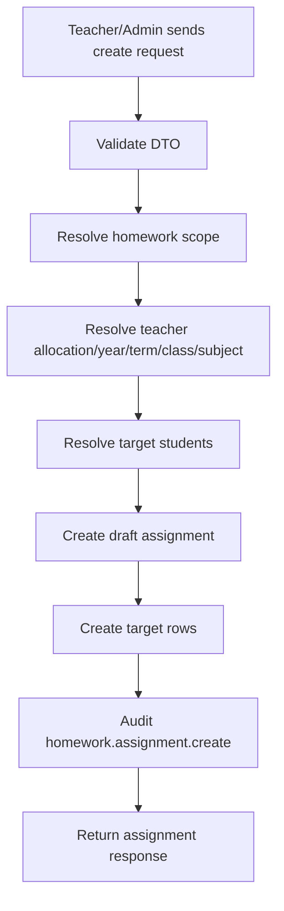
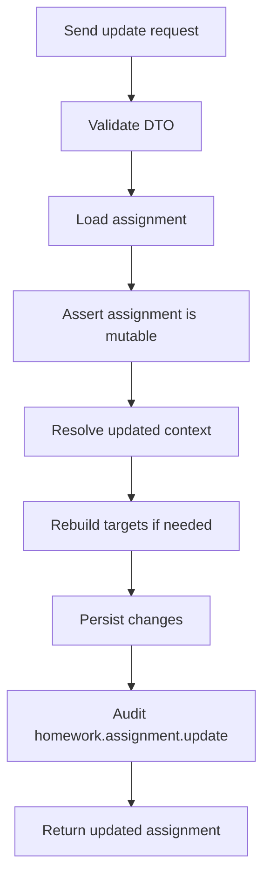
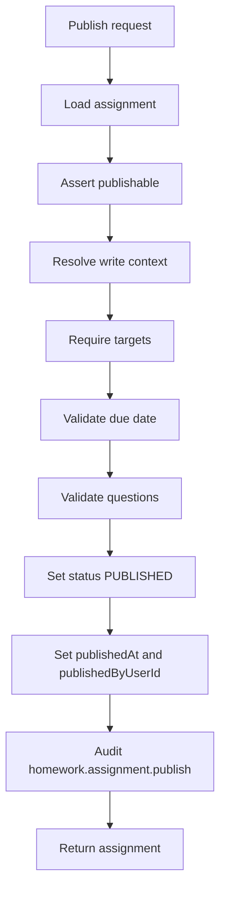
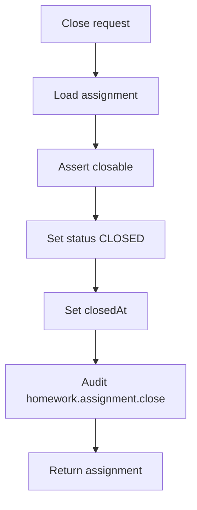
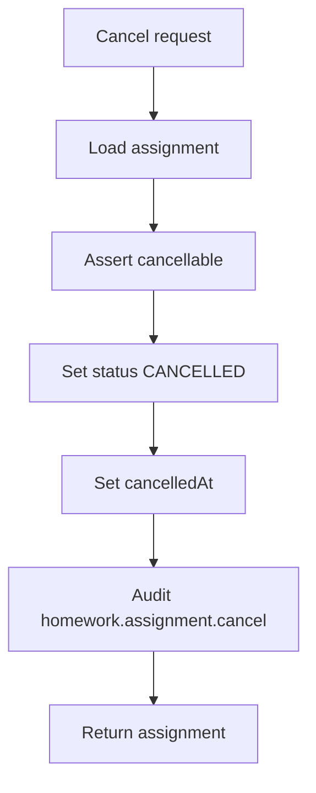
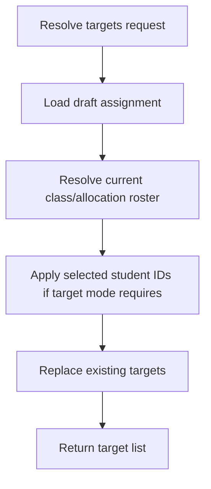
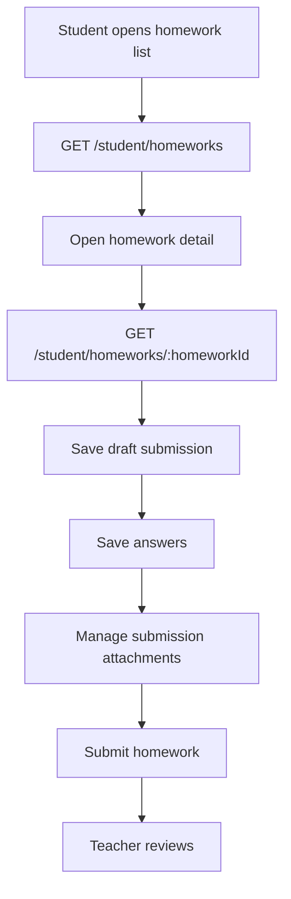
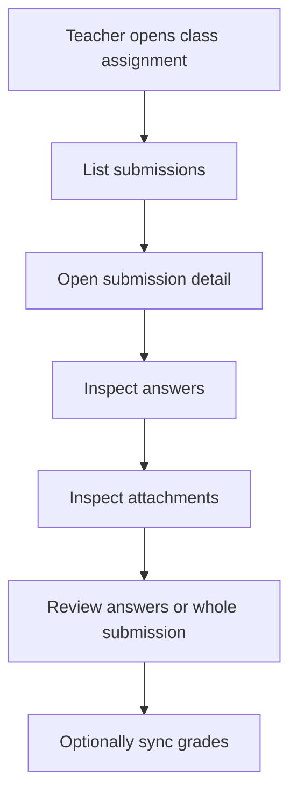
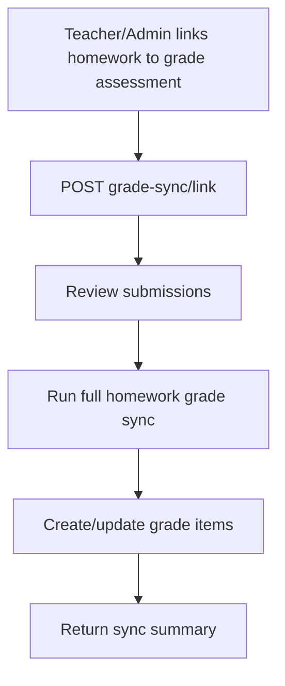
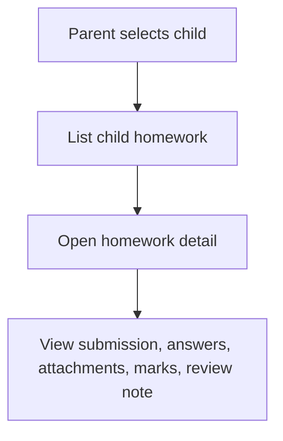

# Homework API Documentation

Generated from the `Moazez-Backend` / `sis_dashboard` repository analysis.

## Table of Contents

1. [Overview](#overview)
2. [Global API Behavior](#global-api-behavior)
3. [Core Homework Assignment API](#core-homework-assignment-api)
4. [Teacher Homework API](#teacher-homework-api)
5. [Student Homework API](#student-homework-api)
6. [Parent Homework API](#parent-homework-api)
7. [Request DTOs and Filters](#request-dtos-and-filters)
8. [Response Shapes](#response-shapes)
9. [Permissions](#permissions)
10. [Errors](#errors)
11. [Main Business Flows](#main-business-flows)
12. [Unavailable / Deferred Routes](#unavailable--deferred-routes)
13. [Implementation Notes and Recommendations](#implementation-notes-and-recommendations)

---

## Overview

The Homework module provides a full homework lifecycle for school users:

- Admin / core homework assignment management.
- Teacher-facing homework management per class.
- Student-facing homework list, draft, answer, attachment, and submit flow.
- Parent-facing read-only homework tracking for children.
- Question, option, attachment, target, submission review, and grade-sync support.
- Validation, permissions, tenancy scope, and domain-specific error codes.

The API is mounted under:

```http
/api/v1
```

Main route groups:

```http
/api/v1/homework/assignments
/api/v1/teacher/homeworks
/api/v1/student/homeworks
/api/v1/parent/children/:studentId/homeworks
```

---

## Global API Behavior

The backend uses NestJS global validation and error handling.

### Validation

Request validation uses:

- `whitelist: true`
- `forbidNonWhitelisted: true`
- `transform: true`

This means:

- Unknown body/query properties are rejected.
- DTO types are transformed automatically where possible.
- Validation errors are returned through the global error envelope.

### Global Guards / Middleware

The app applies:

1. JWT authentication guard.
2. Request scope resolver guard.
3. Permission guard.
4. Request context middleware.
5. Global exception filter.

### Error Envelope

All errors are normalized into this structure:

```json
{
  "error": {
    "code": "string",
    "message": "string",
    "details": {},
    "traceId": "string"
  }
}
```

---

## Core Homework Assignment API

Base path:

```http
/api/v1/homework/assignments
```

### Assignment Endpoints

| Method | Endpoint | Description | Main Permission |
|---|---|---|---|
| `GET` | `/homework/assignments` | List homework assignments | `homework.assignments.view` |
| `POST` | `/homework/assignments` | Create homework assignment draft | `homework.assignments.manage` |
| `GET` | `/homework/assignments/:homeworkId` | Get assignment details | `homework.assignments.view` |
| `PATCH` | `/homework/assignments/:homeworkId` | Update assignment draft | `homework.assignments.manage` |
| `POST` | `/homework/assignments/:homeworkId/publish` | Publish assignment | `homework.assignments.manage` |
| `POST` | `/homework/assignments/:homeworkId/close` | Close assignment | `homework.assignments.manage` |
| `POST` | `/homework/assignments/:homeworkId/cancel` | Cancel assignment | `homework.assignments.manage` |

### Targets Endpoints

| Method | Endpoint | Description | Main Permission |
|---|---|---|---|
| `GET` | `/homework/assignments/:homeworkId/targets` | List resolved targets | `homework.targets.view` |
| `POST` | `/homework/assignments/:homeworkId/targets/resolve` | Resolve/rebuild targets | `homework.targets.manage` |

### Questions Endpoints

| Method | Endpoint | Description | Main Permission |
|---|---|---|---|
| `GET` | `/homework/assignments/:homeworkId/questions` | List assignment questions | `homework.assignments.view` |
| `POST` | `/homework/assignments/:homeworkId/questions` | Create question | `homework.assignments.manage` |
| `GET` | `/homework/assignments/:homeworkId/questions/:questionId` | Get question details | `homework.assignments.view` |
| `PATCH` | `/homework/assignments/:homeworkId/questions/:questionId` | Update question | `homework.assignments.manage` |
| `PATCH` | `/homework/assignments/:homeworkId/questions/:questionId/reorder` | Reorder question | `homework.assignments.manage` |
| `DELETE` | `/homework/assignments/:homeworkId/questions/:questionId` | Delete question | `homework.assignments.manage` |

### Question Options Endpoints

| Method | Endpoint | Description | Main Permission |
|---|---|---|---|
| `POST` | `/homework/assignments/:homeworkId/questions/:questionId/options` | Create question option | `homework.assignments.manage` |
| `PATCH` | `/homework/assignments/:homeworkId/questions/:questionId/options/:optionId` | Update option | `homework.assignments.manage` |
| `PATCH` | `/homework/assignments/:homeworkId/questions/:questionId/options/:optionId/reorder` | Reorder option | `homework.assignments.manage` |
| `DELETE` | `/homework/assignments/:homeworkId/questions/:questionId/options/:optionId` | Delete option | `homework.assignments.manage` |

### Assignment Attachments Endpoints

| Method | Endpoint | Description | Main Permission |
|---|---|---|---|
| `GET` | `/homework/assignments/:homeworkId/attachments` | List assignment attachments | `homework.assignments.view` |
| `POST` | `/homework/assignments/:homeworkId/attachments` | Add assignment attachment | `homework.assignments.manage` |
| `PATCH` | `/homework/assignments/:homeworkId/attachments/:attachmentId` | Update attachment | `homework.assignments.manage` |
| `PATCH` | `/homework/assignments/:homeworkId/attachments/:attachmentId/reorder` | Reorder attachment | `homework.assignments.manage` |
| `DELETE` | `/homework/assignments/:homeworkId/attachments/:attachmentId` | Delete attachment | `homework.assignments.manage` |

Delete attachment returns:

```http
204 No Content
```

### Submission Review Content Endpoints

Base nested path:

```http
/homework/assignments/:homeworkId/submissions/:submissionId
```

| Method | Endpoint | Description | Main Permission |
|---|---|---|---|
| `GET` | `/answers` | List submission answers | `homework.submissions.view` |
| `GET` | `/answers/:answerId` | Get one answer | `homework.submissions.view` |
| `PATCH` | `/answers/:answerId/review` | Review one answer | `homework.assignments.manage` |
| `PUT` | `/answers/review` | Bulk review answers | `homework.assignments.manage` |
| `GET` | `/attachments` | List submission attachments | `homework.submissions.view` |

### Grade Sync Endpoints

| Method | Endpoint | Description | Required Permissions |
|---|---|---|---|
| `GET` | `/homework/assignments/:homeworkId/grade-sync` | Get grade sync status | `homework.assignments.view`, `grades.items.view` |
| `POST` | `/homework/assignments/:homeworkId/grade-sync/link` | Link homework to grade assessment | `homework.assignments.manage`, `grades.assessments.manage` |
| `POST` | `/homework/assignments/:homeworkId/grade-sync` | Sync homework grades | `homework.assignments.manage`, `grades.items.manage` |
| `POST` | `/homework/assignments/:homeworkId/submissions/:submissionId/grade-sync` | Sync one submission grade | `homework.assignments.manage`, `grades.items.manage` |

---

## Teacher Homework API

Base path:

```http
/api/v1/teacher/homeworks
```

Teacher APIs wrap core homework functionality with teacher app access and teacher ownership checks.

### Teacher Dashboard

| Method | Endpoint | Description |
|---|---|---|
| `GET` | `/teacher/homeworks/dashboard` | Get teacher homework dashboard |

### Teacher Class Assignments

| Method | Endpoint | Description |
|---|---|---|
| `GET` | `/teacher/homeworks/classes/:classId/assignments` | List class homework assignments |
| `POST` | `/teacher/homeworks/classes/:classId/assignments` | Create class homework assignment |
| `GET` | `/teacher/homeworks/classes/:classId/assignments/:homeworkId` | Get assignment details |
| `PATCH` | `/teacher/homeworks/classes/:classId/assignments/:homeworkId` | Update assignment |
| `POST` | `/teacher/homeworks/classes/:classId/assignments/:homeworkId/publish` | Publish assignment |
| `POST` | `/teacher/homeworks/classes/:classId/assignments/:homeworkId/close` | Close assignment |
| `POST` | `/teacher/homeworks/classes/:classId/assignments/:homeworkId/cancel` | Cancel assignment |

### Teacher Questions and Options

The teacher route mirrors the core question/option structure:

```http
/teacher/homeworks/classes/:classId/assignments/:homeworkId/questions
```

| Method | Endpoint | Description |
|---|---|---|
| `GET` | `/questions` | List questions |
| `POST` | `/questions` | Create question |
| `GET` | `/questions/:questionId` | Get question |
| `PATCH` | `/questions/:questionId` | Update question |
| `PATCH` | `/questions/:questionId/reorder` | Reorder question |
| `DELETE` | `/questions/:questionId` | Delete question |
| `POST` | `/questions/:questionId/options` | Create option |
| `PATCH` | `/questions/:questionId/options/:optionId` | Update option |
| `PATCH` | `/questions/:questionId/options/:optionId/reorder` | Reorder option |
| `DELETE` | `/questions/:questionId/options/:optionId` | Delete option |

### Teacher Attachments

```http
/teacher/homeworks/classes/:classId/assignments/:homeworkId/attachments
```

| Method | Endpoint | Description |
|---|---|---|
| `GET` | `/attachments` | List attachments |
| `POST` | `/attachments` | Add attachment |
| `PATCH` | `/attachments/:attachmentId` | Update attachment |
| `PATCH` | `/attachments/:attachmentId/reorder` | Reorder attachment |
| `DELETE` | `/attachments/:attachmentId` | Delete attachment |

### Teacher Submissions

```http
/teacher/homeworks/classes/:classId/assignments/:homeworkId/submissions
```

| Method | Endpoint | Description |
|---|---|---|
| `GET` | `/submissions` | List homework submissions |
| `GET` | `/submissions/:submissionId` | Get submission details |
| `GET` | `/submissions/:submissionId/answers` | List submission answers |
| `GET` | `/submissions/:submissionId/attachments` | List submission attachments |
| `POST` | `/submissions/:submissionId/review` | Review submission |

### Teacher Targets

| Method | Endpoint | Description |
|---|---|---|
| `GET` | `/teacher/homeworks/classes/:classId/assignments/:homeworkId/targets` | List targets |
| `POST` | `/teacher/homeworks/classes/:classId/assignments/:homeworkId/targets/resolve` | Resolve targets |

---

## Student Homework API

Base path:

```http
/api/v1/student/homeworks
```

### Student Endpoints

| Method | Endpoint | Description |
|---|---|---|
| `GET` | `/student/homeworks` | List current student homework |
| `GET` | `/student/homeworks/:homeworkId` | Get homework detail |
| `GET` | `/student/homeworks/:homeworkId/submission` | Get current student submission |
| `PUT` | `/student/homeworks/:homeworkId/submission` | Save submission draft |
| `POST` | `/student/homeworks/:homeworkId/submission/draft` | Save draft alias |
| `GET` | `/student/homeworks/:homeworkId/submission/answers` | List saved answers |
| `PUT` | `/student/homeworks/:homeworkId/submission/answers` | Bulk save answers |
| `PATCH` | `/student/homeworks/:homeworkId/submission/answers/:questionId` | Save one answer |
| `GET` | `/student/homeworks/:homeworkId/submission/attachments` | List submission attachments |
| `POST` | `/student/homeworks/:homeworkId/submission/attachments` | Add submission attachment |
| `PATCH` | `/student/homeworks/:homeworkId/submission/attachments/:attachmentId` | Update submission attachment |
| `DELETE` | `/student/homeworks/:homeworkId/submission/attachments/:attachmentId` | Delete submission attachment |
| `POST` | `/student/homeworks/:homeworkId/submit` | Submit homework |
| `POST` | `/student/homeworks/:homeworkId/submission/submit` | Submit homework alias |

### Student List Filters

`GET /student/homeworks`

| Query Param | Type | Notes |
|---|---|---|
| `status` | enum | `waiting`, `completed`, `not_completed` |
| `mode` | enum | `homework`, `worksheet`, `writing_task`, `quiz`, `reading`, `project` |
| `dueFrom` | ISO date | Optional lower due-date filter |
| `dueTo` | ISO date | Optional upper due-date filter |
| `search` | string | Search by title/content |
| `page` | number | Minimum `1` |
| `limit` | number | Maximum `100` |

### Student Submission Statuses

Student submissions may appear as:

```text
draft
submitted
late
reviewed
```

---

## Parent Homework API

Base path:

```http
/api/v1/parent/children/:studentId/homeworks
```

Parent homework access is read-only.

### Parent Endpoints

| Method | Endpoint | Description |
|---|---|---|
| `GET` | `/parent/children/:studentId/homeworks` | List homework for a child |
| `GET` | `/parent/children/:studentId/homeworks/:homeworkId` | Get child homework detail |

### Parent Filters

`GET /parent/children/:studentId/homeworks`

| Query Param | Type | Notes |
|---|---|---|
| `status` | enum | `waiting`, `completed`, `not_completed` |
| `mode` | enum | `homework`, `worksheet`, `writing_task`, `quiz`, `reading`, `project` |
| `dueFrom` | ISO date | Optional lower due-date filter |
| `dueTo` | ISO date | Optional upper due-date filter |
| `search` | string | Search by title/content |
| `page` | number | Minimum `1` |
| `limit` | number | Maximum `100` |

Parent routes do **not** support:

- Submit homework.
- Save answers.
- Manage attachments.
- Edit submission.
- Review submission.

---

## Request DTOs and Filters

## Assignment List Filters

Endpoint:

```http
GET /api/v1/homework/assignments
```

Supported query parameters:

| Query Param | Type | Notes |
|---|---|---|
| `academicYearId` | UUID | Filter by academic year |
| `termId` | UUID | Filter by term |
| `classroomId` | UUID | Filter by classroom |
| `teacherUserId` | UUID | Filter by teacher user |
| `teacherSubjectAllocationId` | UUID | Filter by teacher-subject allocation |
| `status` | enum | Assignment status, uppercased before enum validation |
| `mode` | enum | Homework mode, uppercased before enum validation |
| `dueFrom` | ISO date | Lower due-date filter |
| `dueTo` | ISO date | Upper due-date filter |
| `search` | string | Trimmed, max 200 chars |
| `page` | number | Minimum `1` |
| `limit` | number | `1..100` |

### Create Assignment Request

Endpoint:

```http
POST /api/v1/homework/assignments
```

Required fields:

```json
{
  "academicYearId": "uuid",
  "termId": "uuid",
  "teacherSubjectAllocationId": "uuid",
  "title": "Homework title",
  "targetMode": "enum",
  "dueAt": "2026-06-30T12:00:00.000Z"
}
```

Optional fields:

```json
{
  "timetableEntryId": "uuid",
  "scheduleDate": "2026-06-30",
  "description": "Homework instructions",
  "mode": "homework",
  "studentIds": ["uuid"],
  "publishAt": "2026-06-29T12:00:00.000Z",
  "estimatedMinutes": 30,
  "totalMarks": 100,
  "isGraded": true
}
```

Validation notes:

| Field | Validation |
|---|---|
| `title` | Required, `1..180` chars |
| `description` | Optional, max `4000` chars |
| `studentIds` | Optional, unique UUIDs, max `500` |
| `estimatedMinutes` | Optional, minimum `1` |
| `totalMarks` | Optional, minimum `0.01`, max 2 decimal places |
| `dueAt` | Required ISO date |
| `publishAt` | Optional ISO date |

### Update Assignment Request

Endpoint:

```http
PATCH /api/v1/homework/assignments/:homeworkId
```

Same fields as create assignment, but all are optional.

Example:

```json
{
  "title": "Updated homework title",
  "description": "Updated instructions",
  "dueAt": "2026-07-01T12:00:00.000Z",
  "estimatedMinutes": 45,
  "isGraded": true,
  "totalMarks": 50
}
```

### Grade Sync Link Request

Endpoint:

```http
POST /api/v1/homework/assignments/:homeworkId/grade-sync/link
```

```json
{
  "gradeAssessmentId": "uuid"
}
```

---

## Response Shapes

## Assignment Response

Assignment responses may include:

```json
{
  "id": "uuid",
  "title": "Homework title",
  "description": "Instructions",
  "mode": "homework",
  "status": "draft",
  "targetMode": "class",
  "academicYear": {},
  "term": {},
  "classroom": {},
  "subject": {},
  "teacher": {},
  "teacherSubjectAllocationId": "uuid",
  "timetableEntryId": "uuid",
  "scheduleDate": "2026-06-30",
  "publishAt": "2026-06-29T12:00:00.000Z",
  "publishedAt": null,
  "dueAt": "2026-06-30T12:00:00.000Z",
  "closedAt": null,
  "cancelledAt": null,
  "estimatedMinutes": 30,
  "totalMarks": 100,
  "isGraded": true,
  "questionCount": 5,
  "attachmentCount": 2,
  "questions": [],
  "attachments": [],
  "counters": {},
  "createdAt": "2026-06-22T12:00:00.000Z",
  "updatedAt": "2026-06-22T12:00:00.000Z"
}
```

### List Response

List endpoints use a paginated envelope:

```json
{
  "items": [],
  "meta": {
    "page": 1,
    "limit": 25,
    "total": 0,
    "totalPages": 0
  }
}
```

### Target Response

Target responses expose safe student-target rows:

```json
{
  "targetId": "uuid",
  "studentId": "uuid",
  "enrollmentId": "uuid",
  "student": {
    "id": "uuid",
    "displayName": "Student Name"
  },
  "status": "assigned",
  "assignedAt": "2026-06-22T12:00:00.000Z",
  "viewedAt": null,
  "submittedAt": null,
  "reviewedAt": null,
  "excusedAt": null
}
```

### Student Homework Response

Student-facing responses may include:

```json
{
  "id": "uuid",
  "title": "Homework title",
  "description": "Instructions",
  "mode": "homework",
  "status": "waiting",
  "assignmentStatus": "published",
  "targetStatus": "assigned",
  "subject": {},
  "teacher": {},
  "classroom": {},
  "term": {},
  "academicYear": {},
  "dueAt": "2026-06-30T12:00:00.000Z",
  "isGraded": true,
  "totalMarks": 100,
  "questionCount": 5,
  "attachmentCount": 2,
  "submittedAt": null,
  "reviewedAt": null,
  "questions": [],
  "attachments": [],
  "submission": {}
}
```

### Parent Homework Response

Parent-facing details may include:

```json
{
  "child": {
    "studentId": "uuid",
    "displayName": "Student Name"
  },
  "homework": {
    "id": "uuid",
    "title": "Homework title",
    "mode": "homework",
    "status": "waiting",
    "dueAt": "2026-06-30T12:00:00.000Z"
  },
  "teacher": {},
  "classroom": {},
  "subject": {},
  "questions": [],
  "attachments": [],
  "submission": {},
  "answers": [],
  "reviewNote": "Teacher note",
  "awardedMarks": 90,
  "totalMarks": 100
}
```

### Grade Sync Response

Grade sync responses may include:

```json
{
  "homeworkId": "uuid",
  "linked": true,
  "gradeAssessment": {
    "id": "uuid",
    "title": "Assessment title"
  },
  "syncSummary": {
    "total": 10,
    "synced": 10,
    "skipped": 0,
    "failed": 0
  },
  "warnings": [],
  "submissionSync": {
    "submissionId": "uuid",
    "studentId": "uuid",
    "enrollmentId": "uuid",
    "score": 95,
    "gradeItemId": "uuid",
    "synced": true,
    "idempotent": true
  }
}
```

---

## Permissions

### Core Permissions

| Action | Permission |
|---|---|
| View homework assignments | `homework.assignments.view` |
| Create/update/publish/close/cancel assignments | `homework.assignments.manage` |
| View targets | `homework.targets.view` |
| Resolve targets | `homework.targets.manage` |
| View submission answers/attachments | `homework.submissions.view` |
| Review submission answers | `homework.assignments.manage` |
| View grade sync status | `homework.assignments.view`, `grades.items.view` |
| Link grade sync | `homework.assignments.manage`, `grades.assessments.manage` |
| Run grade sync | `homework.assignments.manage`, `grades.items.manage` |

### Scope Requirements

Core homework logic requires:

- Authenticated actor.
- Active school membership.
- School scope.
- Organization scope.
- User type.
- Role id.

The homework scope contains:

```json
{
  "actorId": "uuid",
  "userType": "teacher/admin/student/parent",
  "organizationId": "uuid",
  "schoolId": "uuid",
  "roleId": "uuid"
}
```

### Teacher Access

Teacher app endpoints add:

- Teacher app access checks.
- Teacher allocation checks.
- Class ownership / assignment ownership checks.

### Student Access

Student app endpoints are scoped to the current authenticated student.

Students can only access homework assigned to them through resolved targets.

### Parent Access

Parent app endpoints are scoped to a child relationship.

Parents can only view homework for their own children.

Parent homework access is read-only.

---

## Errors

## Error Envelope

All errors use:

```json
{
  "error": {
    "code": "string",
    "message": "string",
    "details": {},
    "traceId": "string"
  }
}
```

## Default / Global Error Codes

| Code | Meaning |
|---|---|
| `validation.failed` | DTO validation failed |
| `auth.token.invalid` | Missing/invalid actor token |
| `auth.scope.missing` | Required school/request scope missing |
| `not_found` | Generic not found |
| `conflict` | Generic conflict |

## Assignment Error Codes

| Code | HTTP | Meaning |
|---|---:|---|
| `homework.assignment.not_found` | 404 | Assignment was not found |
| `homework.assignment.not_mutable` | 409 | Assignment cannot be changed in current status |
| `homework.assignment.not_publishable` | 422 | Assignment cannot be published |
| `homework.assignment.already_published` | 409 | Assignment is already published |
| `homework.assignment.already_closed` | 409 | Assignment is already closed |
| `homework.assignment.cancelled` | 409 | Assignment is cancelled |
| `homework.assignment.schedule_mismatch` | 422 | Schedule does not match assignment context |
| `homework.assignment.allocation_mismatch` | 422 | Teacher allocation does not match context |
| `homework.assignment.due_date_invalid` | 422 | Due date is invalid |
| `homework.assignment.target_required` | 422 | Assignment requires at least one target |
| `homework.assignment.no_eligible_targets` | 422 | No eligible students were found |
| `homework.assignment.target_conflict` | 409 | Target conflict occurred |
| `homework.assignment.validation_failed` | 422 | Domain validation failed |

## Submission Error Codes

| Code | HTTP | Meaning |
|---|---:|---|
| `homework.submission.target_not_found` | 404 | Student target was not found |
| `homework.submission.not_found` | 404 | Submission was not found |
| `homework.submission.not_submittable` | 409 | Submission cannot be submitted |
| `homework.submission.not_reviewable` | 409 | Submission cannot be reviewed |
| `homework.submission.already_reviewed` | 409 | Submission already reviewed |
| `homework.submission.review_invalid` | 422 | Review payload is invalid |
| `homework.submission.already_submitted` | 409 | Submission already submitted |

---

## Main Business Flows

## 1. Create Draft Homework



Result:

- Assignment is created as draft.
- Targets are prepared depending on `targetMode`.
- Assignment can still be edited.

## 2. Update Draft Homework



Important:

- Usually only draft/mutable assignments can be changed.
- Published/closed/cancelled homework may reject updates.

## 3. Publish Homework



Publishing requires:

- Valid assignment state.
- Valid due date.
- At least one eligible target.
- Valid publishable question setup.

## 4. Close Homework



## 5. Cancel Homework



## 6. Resolve Targets



Use this when:

- The roster changed.
- Selected students changed.
- Targets need to be recalculated before publishing.

## 7. Student Homework Flow



Student can:

- View assigned homework.
- Save draft submission.
- Save answers.
- Add/update/delete submission attachments.
- Submit homework.

Student cannot:

- Edit homework assignment.
- Review their own homework.
- Sync grades.

## 8. Teacher Review Flow



Teacher submission filter statuses include:

```text
submitted
late
reviewed
pending_review
```

## 9. Grade Sync Flow



Single-submission sync is also available:

```http
POST /homework/assignments/:homeworkId/submissions/:submissionId/grade-sync
```

## 10. Parent View Flow



Parent access is strictly read-only.

---

## Unavailable / Deferred Routes

The route inventory explicitly keeps several homework-related routes unregistered.

These are **not available** in the current implementation:

```http
GET /api/v1/homework/submissions
POST /api/v1/homework/submissions
GET /api/v1/homework/assignments/:homeworkId/submissions
POST /api/v1/homework/assignments/:homeworkId/submissions/:submissionId/review
GET /api/v1/homework/questions
POST /api/v1/homework/questions
GET /api/v1/homework/attachments
POST /api/v1/homework/attachments
GET /api/v1/student/homeworks/:homeworkId/submission/history
GET /api/v1/student/homeworks/:homeworkId/questions
GET /api/v1/student/homeworks/:homeworkId/attachments
POST /api/v1/parent/children/:studentId/homeworks/:homeworkId/submit
POST /api/v1/parent/children/:studentId/homeworks/:homeworkId/submission/submit
GET /api/v1/parent/children/:studentId/homeworks/:homeworkId/questions
GET /api/v1/parent/children/:studentId/homeworks/:homeworkId/attachments
GET /api/v1/parent/homeworks
POST /api/v1/teacher/homeworks/classes/:classId/assignments/:homeworkId/submissions/:submissionId/sync-grade-item
```

Also unavailable:

- Homework proof routes.
- Upload-specific homework proof routes.
- XP routes.
- Reward routes.
- Parent submission mutation routes.
- Student submission history routes.

---

## Implementation Notes and Recommendations

### Strengths

- Clear separation between core homework APIs and app-facing teacher/student/parent APIs.
- Strong DTO validation.
- Consistent global error envelope.
- Domain-specific error codes.
- Permission-based access control.
- Tenant/school scope enforcement.
- Teacher ownership layer for teacher-facing routes.
- Parent routes are safely read-only.
- Student routes are limited to the authenticated student's assigned homework.
- Grade sync requires explicit grade permissions.

### High-Risk Areas to Test Carefully

1. **Teacher ownership**
   - A teacher should not access homework for a class/allocation they do not own.

2. **Parent-child relationship**
   - A parent should only view homework for their own children.

3. **Student target checks**
   - A student should only view/submit homework assigned to them.

4. **Publishing validation**
   - Homework with no targets, invalid due date, or invalid question setup should not publish.

5. **Late submission logic**
   - Submissions after `dueAt` should be classified correctly.

6. **Grade sync idempotency**
   - Running grade sync multiple times should not create duplicate grade items.

7. **Permission combinations**
   - Users with view permissions should not perform manage actions.
   - Users with homework permissions but no grade permissions should not access grade sync.

8. **Validation whitelist**
   - Unknown fields should fail validation.

9. **Cancelled/closed states**
   - Cancelled or closed homework should reject invalid mutations/submissions.

---

## Suggested QA Checklist

### Assignment Management

- [ ] Create draft homework with valid class target.
- [ ] Create draft homework with selected student targets.
- [ ] Reject create request with invalid UUID.
- [ ] Reject create request with unknown fields.
- [ ] Reject create request without required fields.
- [ ] Update draft homework.
- [ ] Reject update on published/closed/cancelled homework.
- [ ] Resolve targets successfully.
- [ ] Publish homework with valid targets/questions.
- [ ] Reject publish without eligible targets.
- [ ] Reject publish with invalid due date.
- [ ] Close published homework.
- [ ] Cancel draft/published homework according to business rules.

### Questions and Options

- [ ] Create question.
- [ ] Update question.
- [ ] Reorder question.
- [ ] Delete question.
- [ ] Create option.
- [ ] Update option.
- [ ] Reorder option.
- [ ] Delete option.
- [ ] Reject invalid option/question IDs.
- [ ] Reject question changes when assignment is not mutable.

### Attachments

- [ ] Add assignment attachment.
- [ ] Update assignment attachment.
- [ ] Reorder assignment attachment.
- [ ] Delete assignment attachment.
- [ ] Verify delete returns `204 No Content`.
- [ ] Reject invalid attachment data.

### Student Flow

- [ ] Student sees only assigned homework.
- [ ] Student opens homework details.
- [ ] Student saves draft.
- [ ] Student saves bulk answers.
- [ ] Student saves one answer.
- [ ] Student adds submission attachment.
- [ ] Student submits homework.
- [ ] Student cannot resubmit if already submitted unless business rules allow.
- [ ] Student cannot submit unassigned homework.
- [ ] Student cannot submit cancelled/closed homework.

### Teacher Flow

- [ ] Teacher lists class assignments.
- [ ] Teacher creates class assignment.
- [ ] Teacher lists submissions.
- [ ] Teacher opens submission detail.
- [ ] Teacher reviews answers.
- [ ] Teacher reviews submission.
- [ ] Teacher cannot access another teacher's class homework.

### Parent Flow

- [ ] Parent lists child homework.
- [ ] Parent opens child homework detail.
- [ ] Parent sees submission/review/marks.
- [ ] Parent cannot submit homework.
- [ ] Parent cannot access unrelated child homework.

### Grade Sync

- [ ] Link homework to grade assessment.
- [ ] Get grade sync status.
- [ ] Run full homework grade sync.
- [ ] Run single submission grade sync.
- [ ] Verify idempotency.
- [ ] Reject grade sync without grade permissions.

