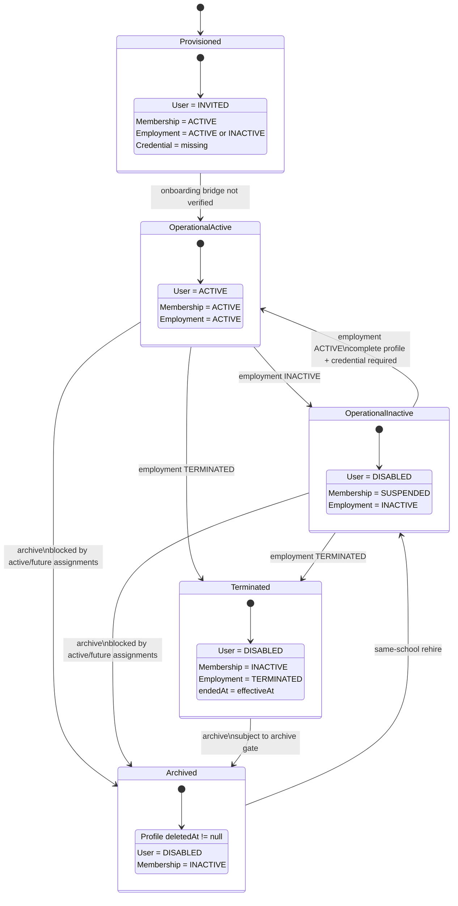
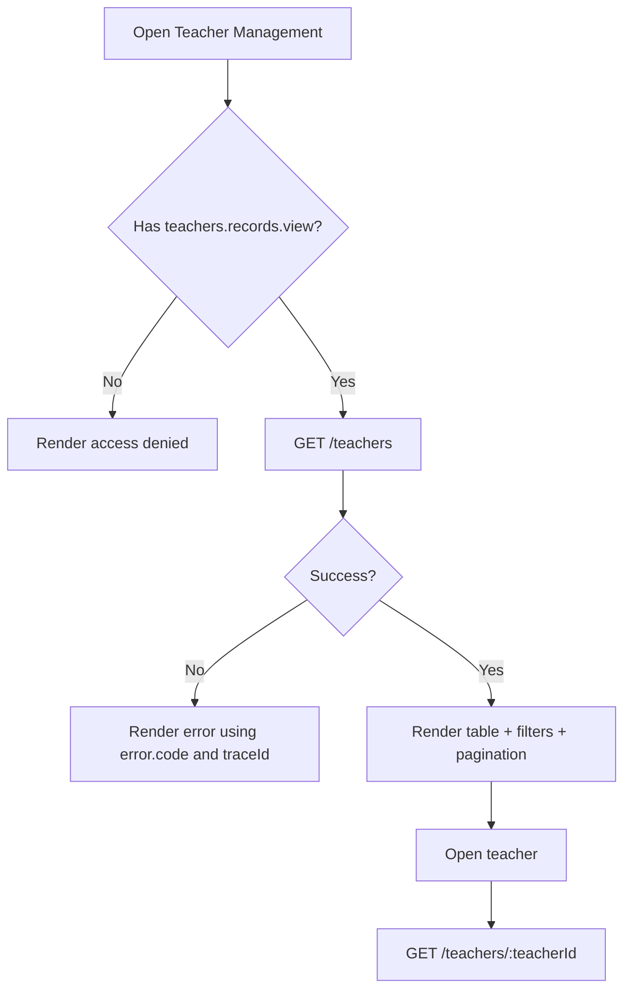
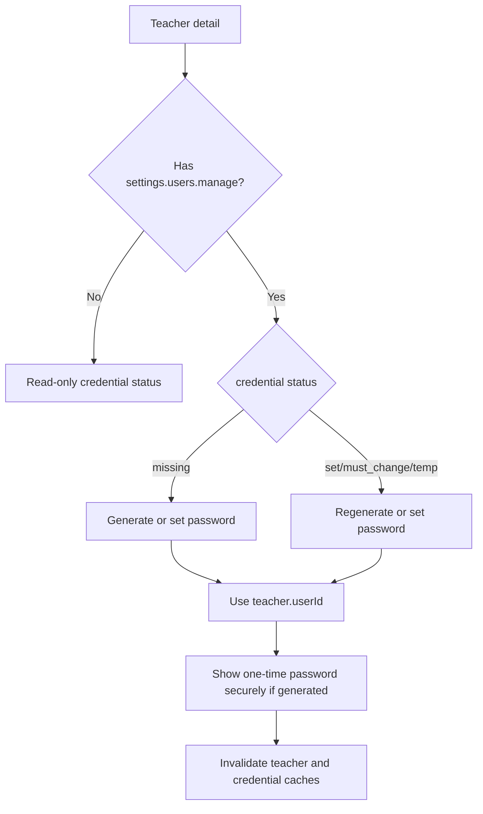

# Teacher Management Dashboard — API Contract and Workflow

> Repository: `Abdallah-Mohamed-Abdallah-AbdulRazzaq/Moazez-Backend`
> Inspected branch: `main`
> Inspected commit: `136564fa9dea10f16b5364b4c8b8feadd983a066`
> Contract date: `2026-07-21`
> API prefix: `/api/v1`
> Swagger UI: `/api/v1/docs`

---

## 1. Purpose

This document is the frontend integration contract for **Teacher Management** in the school dashboard.

It covers:

- teacher directory listing and search;
- teacher creation;
- teacher details and editing;
- credential generation and password setup;
- employment activation, inactivation, and termination;
- soft archive and same-school rehire;
- organization-only cross-school transfer;
- permissions, tenancy, validation, errors, UI states, cache invalidation, and acceptance tests.

This contract describes the behavior implemented by the inspected repository. It does not assert that the inspected code is deployed to any particular environment.

---

## 2. Executive Integration Rules

1. **Teacher record ID and user ID are different.**
   - `teacher.id` is `TeacherProfile.id`.
   - Use it with `/teachers/:teacherId`.
   - `teacher.userId` is `User.id`.
   - Use it with credential endpoints under `/settings/users/:userId/credentials`.

2. **School scope is server-resolved.**
   - Do not send `schoolId` or `organizationId` to teacher directory endpoints.
   - The backend derives the current school from the authenticated membership.
   - Possessing a permission without an active school scope is insufficient.

3. **Success responses are direct DTOs.**
   - They are not wrapped in `{ data: ... }`.
   - Errors use a shared `{ error: ... }` envelope.

4. **Unknown request fields are rejected.**
   - The backend uses strict DTO validation with `forbidNonWhitelisted=true`.
   - Do not send UI-only properties, tenant IDs, role IDs, password data, assignment data, avatar data, or lifecycle fields not accepted by the endpoint.

5. **Teacher management and credentials are separate modules.**
   - Creating a teacher does not create a password.
   - Use credential endpoints with `teacher.userId`.

6. **Employment, account, and membership states are separate.**
   - `employmentStatus`, `accountStatus`, and `membershipStatus` must be displayed independently.
   - Do not derive one from another in the frontend.

7. **Archive is soft deletion.**
   - Archived records disappear from the normal teacher list and detail endpoint.
   - Rehire restores the same archived `TeacherProfile.id`.

8. **Cross-school transfer is organization-admin-only.**
   - It is not a school dashboard action.

---

## 3. Base HTTP Contract

### 3.1 Headers

```http
Authorization: Bearer <access-token>
Content-Type: application/json
Accept: application/json
```

An optional trace header may be supplied:

```http
x-trace-id: <client-generated-correlation-id>
```

If absent, the backend generates a trace ID.

### 3.2 Success and error shapes

Successful responses are endpoint-specific direct DTOs.

All failures use:

```json
{
  "error": {
    "code": "teachers.profile.not_found",
    "message": "Teacher profile not found",
    "details": {},
    "traceId": "99710ef4-29f3-47a6-a413-da94a1a43a29"
  }
}
```

`details` may be omitted.

### 3.3 UUID rules

Every `:teacherId`, `:userId`, `:id`, and `destinationSchoolId` must be a valid UUID. Invalid path UUIDs are rejected before the use case executes.

---

## 4. Authentication, Scope, and Permissions

### 4.1 Guard order

The application globally applies:

1. JWT authentication;
2. membership/scope resolution;
3. organization-scope enforcement where required;
4. permission enforcement.

### 4.2 Teacher permissions

| Permission | Dashboard capability |
|---|---|
| `teachers.records.view` | List and view current-school teacher records |
| `teachers.records.manage` | Create, update, change employment state, archive, and rehire |

### 4.3 Default role behavior

| Role | View | Manage |
|---|---:|---:|
| Platform super admin with a trusted active school context | Yes | Yes |
| Organization admin with a trusted active school context | Yes | Yes |
| School admin | Yes | Yes |
| Teacher system role | No | No |
| Custom role without explicit grants | No | No |

A platform or organization actor cannot manufacture a school scope merely by possessing the permission.

### 4.4 Credential permissions

| Permission | Capability |
|---|---|
| `settings.users.view` | View credential status and bulk preview |
| `settings.users.manage` | Generate, set, regenerate, or bulk-generate credentials |

### 4.5 Organization transfer authorization

Cross-school transfer requires all of the following:

- organization-management actor context;
- `teachers.records.manage`;
- source and destination schools owned by the authorized organization;
- exact backend lifecycle and identity checks.

---

## 5. API Quick Reference

### 5.1 Teacher directory

| Method | Path | Permission | Success |
|---|---|---|---|
| `GET` | `/api/v1/teachers` | `teachers.records.view` | `200` list |
| `GET` | `/api/v1/teachers/:teacherId` | `teachers.records.view` | `200` detail |
| `POST` | `/api/v1/teachers` | `teachers.records.manage` | `201` detail |
| `PATCH` | `/api/v1/teachers/:teacherId` | `teachers.records.manage` | `200` detail |
| `PATCH` | `/api/v1/teachers/:teacherId/employment-status` | `teachers.records.manage` | `200` transition result |
| `DELETE` | `/api/v1/teachers/:teacherId` | `teachers.records.manage` | `204` no body |
| `POST` | `/api/v1/teachers/:teacherId/rehire` | `teachers.records.manage` | `200` detail |

### 5.2 Related credential operations

| Method | Path | Permission | Success |
|---|---|---|---|
| `GET` | `/api/v1/settings/users/credentials/status` | `settings.users.view` | `200` |
| `POST` | `/api/v1/settings/users/:userId/credentials/generate` | `settings.users.manage` | `201` |
| `POST` | `/api/v1/settings/users/:userId/credentials/set` | `settings.users.manage` | `201` |
| `POST` | `/api/v1/settings/users/:userId/credentials/regenerate` | `settings.users.manage` | `201` |
| `POST` | `/api/v1/settings/users/credentials/bulk-preview` | `settings.users.view` | `201` |
| `POST` | `/api/v1/settings/users/credentials/bulk-generate` | `settings.users.manage` | `201` |

### 5.3 Organization-only transfer

| Method | Path | Authorization | Success |
|---|---|---|---|
| `POST` | `/api/v1/organization-admin/teachers/:teacherId/transfer` | Organization management + `teachers.records.manage` | `200` |

### 5.4 Related academic allocation surface

Teacher assignment ownership belongs to Academics, not Teacher Directory:

```text
GET    /api/v1/academics/allocations
POST   /api/v1/academics/allocations
PUT    /api/v1/academics/allocations/bulk
POST   /api/v1/academics/allocations/apply-to-grade
POST   /api/v1/academics/allocations/clear-subject
GET    /api/v1/academics/allocations/validation
GET    /api/v1/academics/allocations/teacher-loads
DELETE /api/v1/academics/allocations/:id
```

These require `academics.structure.view` or `academics.structure.manage` and school-management authorization.

---

## 6. Enumerations

```ts
type UserStatus =
  | 'ACTIVE'
  | 'INVITED'
  | 'SUSPENDED'
  | 'DISABLED';

type MembershipStatus =
  | 'ACTIVE'
  | 'INACTIVE'
  | 'TRANSFERRED'
  | 'SUSPENDED';

type TeacherGender =
  | 'MALE'
  | 'FEMALE';

type TeacherEmploymentStatus =
  | 'ACTIVE'
  | 'INACTIVE'
  | 'TERMINATED';

type TeacherEmploymentType =
  | 'FULL_TIME'
  | 'PART_TIME'
  | 'CONTRACT';

type TeacherWorkDay =
  | 'SUNDAY'
  | 'MONDAY'
  | 'TUESDAY'
  | 'WEDNESDAY'
  | 'THURSDAY'
  | 'FRIDAY'
  | 'SATURDAY';

type PreferredDisplayLanguage = 'AR' | 'EN';

type ProfileCompletenessFilter = 'complete' | 'incomplete';

type TeacherCredentialStatus =
  | 'missing'
  | 'temporary_or_must_change'
  | 'must_change'
  | 'set';
```

---

## 7. Shared Response Types

```ts
interface ErrorEnvelope {
  error: {
    code: string;
    message: string;
    details?: Record<string, unknown>;
    traceId?: string;
  };
}

interface TeacherCredentialSummary {
  hasPassword: boolean;
  status: TeacherCredentialStatus;
  mustChangePassword: boolean;
  passwordProvisionedAt: string | null;
  passwordChangedAt: string | null;
  credentialVersion: number;
}

type TeacherProfileCompletenessField =
  | 'teacherCode'
  | 'firstNameAr'
  | 'lastNameAr'
  | 'firstNameEn'
  | 'lastNameEn'
  | 'gender';

interface TeacherProfileCompleteness {
  isComplete: boolean;
  missingFields: TeacherProfileCompletenessField[];
}

interface TeacherDirectoryListItem {
  /** TeacherProfile.id */
  id: string;

  /** User.id; use for credential endpoints */
  userId: string;

  loginEmail: string;
  username: string | null;
  contactEmail: string | null;
  phone: string | null;

  teacherCode: string | null;

  firstNameAr: string | null;
  lastNameAr: string | null;
  firstNameEn: string | null;
  lastNameEn: string | null;

  displayName: {
    firstName: string;
    lastName: string;
    fullName: string;
  };

  gender: TeacherGender | null;
  department: string | null;
  specialization: string | null;

  accountStatus: UserStatus;
  membershipStatus: MembershipStatus;
  membershipEndedAt: string | null;
  employmentStatus: TeacherEmploymentStatus;

  profileCompleteness: TeacherProfileCompleteness;
  credentialSummary: TeacherCredentialSummary;

  createdAt: string;
  updatedAt: string;
}

interface TeacherDirectoryDetail extends TeacherDirectoryListItem {
  employmentType: TeacherEmploymentType | null;
  experienceYears: number | null;

  /** YYYY-MM-DD */
  hireDate: string | null;

  workingDays: TeacherWorkDay[];

  /** HH:mm:ss */
  workStartTime: string | null;

  /** HH:mm:ss */
  workEndTime: string | null;

  notesAr: string | null;
  notesEn: string | null;
}

interface Pagination {
  page: number;
  limit: number;
  total: number;
}

interface TeachersListResponse {
  items: TeacherDirectoryListItem[];
  pagination: Pagination;
}
```

### 7.1 Derived frontend pagination

The backend does not return `totalPages` or `hasNext`.

```ts
const totalPages = Math.ceil(response.pagination.total / response.pagination.limit);
const hasNext = response.pagination.page < totalPages;
const hasPrevious = response.pagination.page > 1;
```

---

## 8. GET `/api/v1/teachers`

Lists live teacher directory records in the authenticated current school.

### 8.1 Permission

```text
teachers.records.view
```

### 8.2 Query parameters

| Parameter | Type | Default | Rules |
|---|---|---:|---|
| `search` | string | — | Max 100 characters |
| `accountStatus` | `UserStatus` | — | Exact enum |
| `membershipStatus` | `MembershipStatus` | — | Exact enum |
| `employmentStatus` | `TeacherEmploymentStatus` | — | Exact enum |
| `gender` | `TeacherGender` | — | Exact enum |
| `profileCompleteness` | `complete \| incomplete` | — | Exact lower-case value |
| `page` | integer | `1` | Minimum 1 |
| `limit` | integer | `20` | 1–100 |

### 8.3 Search behavior

Search is case-insensitive across:

- teacher code;
- Arabic first and last name;
- English first and last name;
- department;
- specialization;
- login email;
- username;
- contact email;
- phone;
- stored display first and last name.

### 8.4 Ordering

The backend uses a fixed stable order:

1. English first name ascending, nulls last;
2. English last name ascending, nulls last;
3. Arabic first name ascending, nulls last;
4. Arabic last name ascending, nulls last;
5. `TeacherProfile.id` ascending as tie-breaker.

There are no client-controlled sort query parameters.

### 8.5 Example request

```http
GET /api/v1/teachers?search=nour&employmentStatus=ACTIVE&profileCompleteness=complete&page=1&limit=20
Authorization: Bearer <access-token>
```

### 8.6 Example response

```json
{
  "items": [
    {
      "id": "9ef42c9f-b5b2-4d42-9419-31e71cb453d0",
      "userId": "22d621e6-2276-4f23-b5f2-25d312d2ce7c",
      "loginEmail": "nour.ali@school.example",
      "username": "nour.ali",
      "contactEmail": "nour.personal@example.com",
      "phone": "+201001234567",
      "teacherCode": "TCH001",
      "firstNameAr": "نور",
      "lastNameAr": "علي",
      "firstNameEn": "Nour",
      "lastNameEn": "Ali",
      "displayName": {
        "firstName": "Nour",
        "lastName": "Ali",
        "fullName": "Nour Ali"
      },
      "gender": "FEMALE",
      "department": "Mathematics",
      "specialization": "Algebra",
      "accountStatus": "ACTIVE",
      "membershipStatus": "ACTIVE",
      "membershipEndedAt": null,
      "employmentStatus": "ACTIVE",
      "profileCompleteness": {
        "isComplete": true,
        "missingFields": []
      },
      "credentialSummary": {
        "hasPassword": true,
        "status": "set",
        "mustChangePassword": false,
        "passwordProvisionedAt": "2026-07-19T09:10:00.000Z",
        "passwordChangedAt": "2026-07-20T10:15:00.000Z",
        "credentialVersion": 2
      },
      "createdAt": "2026-07-18T12:00:00.000Z",
      "updatedAt": "2026-07-20T10:15:00.000Z"
    }
  ],
  "pagination": {
    "page": 1,
    "limit": 20,
    "total": 1
  }
}
```

### 8.7 Dashboard behavior

Recommended table columns:

- display name;
- teacher code;
- department;
- specialization;
- employment status;
- account status;
- credential status;
- profile completeness;
- actions.

Recommended badges:

| Value | Suggested semantic treatment |
|---|---|
| `employmentStatus=ACTIVE` | Positive |
| `employmentStatus=INACTIVE` | Neutral/warning |
| `employmentStatus=TERMINATED` | Destructive |
| `accountStatus=INVITED` | Pending |
| `accountStatus=DISABLED` | Disabled |
| credential `missing` | Action required |
| profile incomplete | Action required |

Do not collapse account, membership, and employment status into a single badge.

---

## 9. GET `/api/v1/teachers/:teacherId`

Returns a live current-school teacher detail.

### 9.1 Permission

```text
teachers.records.view
```

### 9.2 Path parameter

```text
teacherId = TeacherProfile.id
```

### 9.3 Success

```text
200 TeacherDirectoryDetail
```

### 9.4 Safe not-found behavior

The same response is used when the record is:

- nonexistent;
- archived;
- outside the current school;
- inaccessible;
- unsafe to compose because its required identity relation is missing.

```json
{
  "error": {
    "code": "teachers.profile.not_found",
    "message": "Teacher profile not found",
    "traceId": "..."
  }
}
```

The UI should not attempt to distinguish these cases.

---

## 10. POST `/api/v1/teachers`

Atomically provisions a complete teacher identity for the current school.

### 10.1 Permission

```text
teachers.records.manage
```

### 10.2 Request type

```ts
interface CreateTeacherRequest {
  /**
   * Optional only when username is supplied.
   * In username mode the backend generates the login email.
   */
  loginEmail?: string;

  /**
   * Optional alternative to legacy loginEmail mode.
   * Requires active school login-domain settings.
   */
  username?: string;

  contactEmail?: string | null;
  phone?: string | null;

  teacherCode: string;

  firstNameAr: string;
  lastNameAr: string;
  firstNameEn: string;
  lastNameEn: string;

  preferredDisplayLanguage: 'AR' | 'EN';
  gender: TeacherGender;

  /** TERMINATED is rejected during creation */
  employmentStatus: 'ACTIVE' | 'INACTIVE';

  department?: string | null;
  specialization?: string | null;
  employmentType?: TeacherEmploymentType | null;
  experienceYears?: number | null;
  hireDate?: string | null;
  workingDays?: TeacherWorkDay[];
  workStartTime?: string | null;
  workEndTime?: string | null;
  notesAr?: string | null;
  notesEn?: string | null;
}
```

### 10.3 Identity modes

#### A. Username mode

Supply:

```json
{
  "username": "nour.ali",
  "contactEmail": "nour.personal@example.com"
}
```

The backend:

1. requires active school login identity settings;
2. validates and normalizes the username;
3. generates `loginEmail` from the configured school login domain;
4. treats `contactEmail` as the personal/contact address.

Do not send a different `loginEmail` while also sending `username`.

#### B. Legacy login email mode

Supply:

```json
{
  "loginEmail": "nour.ali@example.com"
}
```

When `username` is absent, `loginEmail` is required.

### 10.4 Validation and normalization

| Field | Contract |
|---|---|
| `loginEmail` | Valid email, max 320 |
| `username` | 1–40 characters plus configured school policy |
| `contactEmail` | Valid email or null, max 320 |
| `phone` | Valid phone or null, max 40 |
| `teacherCode` | Required, max 20; trimmed, whitespace removed, uppercased |
| Four bilingual names | Required, each 1–50 after normalization |
| `preferredDisplayLanguage` | Required `AR` or `EN` |
| `gender` | Required `MALE` or `FEMALE` |
| `employmentStatus` | Required `ACTIVE` or `INACTIVE` |
| `department`, `specialization` | Nullable, max 120 |
| `employmentType` | Nullable enum |
| `experienceYears` | Nullable integer 0–60 |
| `hireDate` | Exact calendar-valid `YYYY-MM-DD` |
| `workingDays` | Unique, max seven, canonicalized |
| work times | Both omitted/null together, or both supplied; end must be later |
| notes | Nullable, max 500 each |

### 10.5 Example request

```json
{
  "username": "nour.ali",
  "contactEmail": "nour.personal@example.com",
  "phone": "+201001234567",
  "teacherCode": "TCH 001",
  "firstNameAr": "نور",
  "lastNameAr": "علي",
  "firstNameEn": "Nour",
  "lastNameEn": "Ali",
  "preferredDisplayLanguage": "EN",
  "gender": "FEMALE",
  "employmentStatus": "INACTIVE",
  "department": "Mathematics",
  "specialization": "Algebra",
  "employmentType": "FULL_TIME",
  "experienceYears": 7,
  "hireDate": "2026-07-21",
  "workingDays": [
    "SUNDAY",
    "MONDAY",
    "TUESDAY",
    "WEDNESDAY",
    "THURSDAY"
  ],
  "workStartTime": "07:30",
  "workEndTime": "15:30",
  "notesAr": null,
  "notesEn": "Newly onboarded teacher"
}
```

The normalized `teacherCode` will be `TCH001`.

### 10.6 Success

```text
201 TeacherDirectoryDetail
```

The backend creates one atomic aggregate:

- `User`
  - `userType=TEACHER`
  - `status=INVITED`
  - no password;
- exact current-school teacher `Membership`
  - `status=ACTIVE`
  - `endedAt=null`;
- one complete live `TeacherProfile`
  - requested employment state, `ACTIVE` or `INACTIVE`;
- successful teacher-account and profile audit records.

Initial credential projection is expected to be:

```json
{
  "hasPassword": false,
  "status": "missing",
  "mustChangePassword": false,
  "passwordProvisionedAt": null,
  "passwordChangedAt": null,
  "credentialVersion": 0
}
```

### 10.7 Important onboarding caveat

The inspected code has a lifecycle integration gap that the dashboard must not hide:

- teacher creation persists `User.status=INVITED`;
- login accepts only `User.status=ACTIVE`;
- credential generation does not activate the user;
- `INACTIVE -> ACTIVE` employment activation requires the source account to be `DISABLED` and membership to be `SUSPENDED`;
- creating an `INACTIVE` teacher currently produces `INVITED` plus an `ACTIVE` membership;
- creating an `ACTIVE` teacher still produces an `INVITED` user, while repeating `ACTIVE -> ACTIVE` is invalid.

Therefore, **do not present “Create → Generate Password → Ready to Log In” as a verified end-to-end workflow** until the backend team confirms or adds the intended invite acceptance/account activation bridge.

Recommended UI treatment after create:

```text
Teacher record created.
Account access is pending backend activation/invite-flow clarification.
```

---

## 11. PATCH `/api/v1/teachers/:teacherId`

Updates managed teacher identity and profile fields.

### 11.1 Permission

```text
teachers.records.manage
```

### 11.2 Request type

Every field is optional, but at least one managed change must be supplied.

```ts
interface UpdateTeacherRequest {
  loginEmail?: string;
  username?: string;
  contactEmail?: string | null;
  phone?: string | null;

  teacherCode?: string;

  firstNameAr?: string | null;
  lastNameAr?: string | null;
  firstNameEn?: string | null;
  lastNameEn?: string | null;

  preferredDisplayLanguage?: 'AR' | 'EN';
  gender?: TeacherGender;

  department?: string | null;
  specialization?: string | null;
  employmentType?: TeacherEmploymentType | null;
  experienceYears?: number | null;
  hireDate?: string | null;
  workingDays?: TeacherWorkDay[];
  workStartTime?: string | null;
  workEndTime?: string | null;
  notesAr?: string | null;
  notesEn?: string | null;
}
```

### 11.3 Fields not accepted here

Do not send:

- `employmentStatus`;
- `accountStatus`;
- `membershipStatus`;
- `roleId`;
- `userType`;
- `schoolId`;
- `organizationId`;
- password or credential fields;
- assignments;
- avatar fields;
- deletion/archive fields.

### 11.4 Name projection rule

When any of these changes:

- `firstNameAr`;
- `lastNameAr`;
- `firstNameEn`;
- `lastNameEn`;

`preferredDisplayLanguage` is required in the same request. It selects which language pair updates the compatibility `User.firstName` and `User.lastName` display projection.

### 11.5 Username rule

When `username` changes:

- active school login-domain settings are required;
- the backend regenerates `loginEmail`;
- if `loginEmail` is also supplied, it must equal the generated value.

### 11.6 Clearing nullable fields

Use explicit `null` to clear supported nullable fields:

```json
{
  "specialization": null,
  "notesEn": null
}
```

Omission means “do not change”.

### 11.7 Work-time rule

The pair must be updated together:

```json
{
  "workStartTime": "08:00",
  "workEndTime": "16:00"
}
```

To clear both:

```json
{
  "workStartTime": null,
  "workEndTime": null
}
```

### 11.8 No-op rejection

An empty body or a body containing no managed changes returns:

```json
{
  "error": {
    "code": "validation.failed",
    "message": "No managed fields supplied",
    "traceId": "..."
  }
}
```

### 11.9 Success

```text
200 TeacherDirectoryDetail
```

Ordinary profile editing does not revoke sessions.

---

## 12. Credentials Workflow

Credential operations use `teacher.userId`, not `teacher.id`.

### 12.1 Generate a temporary password

```http
POST /api/v1/settings/users/:userId/credentials/generate
Authorization: Bearer <access-token>
```

No request body.

Success:

```json
{
  "user": {
    "userId": "22d621e6-2276-4f23-b5f2-25d312d2ce7c",
    "fullName": "Nour Ali",
    "username": "nour.ali",
    "loginEmail": "nour.ali@school.example",
    "contactEmail": "nour.personal@example.com",
    "userType": "teacher",
    "roleId": "cc971d48-a33c-4cbd-8324-6216843bbc56",
    "roleKey": "teacher",
    "roleName": "Teacher",
    "status": "temporary_or_must_change",
    "hasPassword": true,
    "mustChangePassword": true,
    "passwordChangedAt": null,
    "passwordProvisionedAt": "2026-07-21T09:00:00.000Z",
    "credentialVersion": 1,
    "lastLoginAt": null,
    "createdAt": "2026-07-21T08:00:00.000Z"
  },
  "temporaryPassword": "MZ-7KQ9-PL2R",
  "mustChangePassword": true,
  "generatedAt": "2026-07-21T09:00:00.000Z",
  "credentialVersion": 1
}
```

The temporary password is one-time response material. The backend stores only its hash.

Frontend requirements:

- reveal it only in a protected result dialog;
- allow copy/download according to product security policy;
- warn that closing the dialog loses access to the plaintext;
- never write it to analytics, logs, error trackers, local storage, or URL state;
- invalidate teacher detail and credential-status caches.

### 12.2 Set an admin-provided password

```http
POST /api/v1/settings/users/:userId/credentials/set
```

```json
{
  "password": "S3curePass!2026",
  "forceResetOnLogin": true
}
```

Rules:

- password length 1–256 at DTO level;
- domain password policy can still reject it;
- `forceResetOnLogin` is optional and defaults to true.

### 12.3 Regenerate a temporary password

```http
POST /api/v1/settings/users/:userId/credentials/regenerate
```

No body. It replaces the existing credential, revokes existing sessions, increments the credential version, and returns a new one-time password.

### 12.4 Credential status list

```http
GET /api/v1/settings/users/credentials/status?roleKey=teacher&credentialStatus=missing&page=1&limit=20
```

Supported filters:

- `roleKey`;
- `userType`;
- `credentialStatus`;
- `search`;
- `page`;
- `limit`.

### 12.5 Credential action eligibility

Single-user generate/regenerate accepts users whose account status is:

- `ACTIVE`;
- `INVITED`.

Other statuses return `iam.credentials.user_not_manageable`.

---

## 13. PATCH `/api/v1/teachers/:teacherId/employment-status`

Changes the employment lifecycle and coordinated access state.

### 13.1 Permission

```text
teachers.records.manage
```

### 13.2 Request

```ts
interface ChangeTeacherEmploymentStatusRequest {
  employmentStatus: TeacherEmploymentStatus;

  /**
   * Exact, calendar-valid, non-future ISO timestamp with Z or numeric offset.
   * Defaults to the server's current time.
   */
  effectiveAt?: string;
}
```

Example:

```json
{
  "employmentStatus": "INACTIVE",
  "effectiveAt": "2026-07-21T10:00:00+03:00"
}
```

Do not send a reason, comment, tenant ID, account status, membership status, role, credential, or assignment change.

### 13.3 Allowed transition matrix

| Source employment | Target employment | Resulting account | Resulting membership | `endedAt` |
|---|---|---|---|---|
| `ACTIVE` | `INACTIVE` | `DISABLED` | `SUSPENDED` | `null` |
| `ACTIVE` | `TERMINATED` | `DISABLED` | `INACTIVE` | `effectiveAt` |
| `INACTIVE` | `ACTIVE` | `ACTIVE` | `ACTIVE` | `null` |
| `INACTIVE` | `TERMINATED` | `DISABLED` | `INACTIVE` | `effectiveAt` |

Rejected:

- `ACTIVE -> ACTIVE`;
- `INACTIVE -> INACTIVE`;
- every transition out of `TERMINATED`;
- every other edge.

### 13.4 Reactivation requirements

`INACTIVE -> ACTIVE` additionally requires:

- complete teacher profile;
- user account currently `DISABLED`;
- membership currently `SUSPENDED`;
- membership `endedAt=null`;
- exact live teacher identity and role;
- existing credential (`hasPassword=true`, status not `missing`).

A missing credential returns `teachers.lifecycle.invalid_transition` with `reasonCode=credential_required`.

### 13.5 Allocation behavior

Employment inactivation and termination are not blocked by allocations.

The backend classifies related allocations and returns:

- whether reassignment is required;
- aggregate current/future/historical/integrity counts.

The endpoint does not mutate assignments.

### 13.6 Session behavior

Every allowed employment transition revokes all active sessions for the teacher in the same lifecycle transaction.

If revocation fails:

- response is `503`;
- lifecycle changes roll back;
- successful lifecycle audits roll back;
- error details indicate the operation is retryable.

### 13.7 Response

```ts
interface TeacherEmploymentStatusResponse {
  teacher: TeacherDirectoryDetail;
  transition: {
    previousEmploymentStatus: TeacherEmploymentStatus;
    employmentStatus: TeacherEmploymentStatus;
    accountStatus: UserStatus;
    membershipStatus: MembershipStatus;
    membershipEndedAt: string | null;
    effectiveAt: string;
    revokedSessionCount: number;
    reassignmentRequired: boolean;
    allocationSummary: {
      currentActiveCount: number;
      futureCount: number;
      historicalCount: number;
      currentInactiveCount: number;
      inconsistentCount: number;
      invalidCount: number;
      integrityRiskCount: number;
      integrityReason: string;
    };
  };
}
```

Example:

```json
{
  "teacher": {
    "id": "9ef42c9f-b5b2-4d42-9419-31e71cb453d0",
    "userId": "22d621e6-2276-4f23-b5f2-25d312d2ce7c",
    "loginEmail": "nour.ali@school.example",
    "username": "nour.ali",
    "contactEmail": "nour.personal@example.com",
    "phone": "+201001234567",
    "teacherCode": "TCH001",
    "firstNameAr": "نور",
    "lastNameAr": "علي",
    "firstNameEn": "Nour",
    "lastNameEn": "Ali",
    "displayName": {
      "firstName": "Nour",
      "lastName": "Ali",
      "fullName": "Nour Ali"
    },
    "gender": "FEMALE",
    "department": "Mathematics",
    "specialization": "Algebra",
    "accountStatus": "DISABLED",
    "membershipStatus": "SUSPENDED",
    "membershipEndedAt": null,
    "employmentStatus": "INACTIVE",
    "profileCompleteness": {
      "isComplete": true,
      "missingFields": []
    },
    "credentialSummary": {
      "hasPassword": true,
      "status": "set",
      "mustChangePassword": false,
      "passwordProvisionedAt": "2026-07-19T09:10:00.000Z",
      "passwordChangedAt": "2026-07-20T10:15:00.000Z",
      "credentialVersion": 2
    },
    "createdAt": "2026-07-18T12:00:00.000Z",
    "updatedAt": "2026-07-21T07:00:00.000Z",
    "employmentType": "FULL_TIME",
    "experienceYears": 7,
    "hireDate": "2026-07-01",
    "workingDays": [
      "SUNDAY",
      "MONDAY",
      "TUESDAY",
      "WEDNESDAY",
      "THURSDAY"
    ],
    "workStartTime": "07:30:00",
    "workEndTime": "15:30:00",
    "notesAr": null,
    "notesEn": null
  },
  "transition": {
    "previousEmploymentStatus": "ACTIVE",
    "employmentStatus": "INACTIVE",
    "accountStatus": "DISABLED",
    "membershipStatus": "SUSPENDED",
    "membershipEndedAt": null,
    "effectiveAt": "2026-07-21T07:00:00.000Z",
    "revokedSessionCount": 2,
    "reassignmentRequired": true,
    "allocationSummary": {
      "currentActiveCount": 3,
      "futureCount": 1,
      "historicalCount": 8,
      "currentInactiveCount": 0,
      "inconsistentCount": 0,
      "invalidCount": 0,
      "integrityRiskCount": 0,
      "integrityReason": "none"
    }
  }
}
```

### 13.8 Dashboard confirmation copy

#### Inactivate

```text
This will disable the teacher account, suspend school access, revoke active
sessions, and may require academic reassignment. The teacher record remains
available and can later be reactivated.
```

#### Terminate

```text
This will terminate employment, disable the account, close the school
membership, and revoke active sessions. A terminated teacher cannot be
reactivated through the employment-status endpoint.
```

After success, prominently surface:

- revoked session count;
- reassignment required;
- current and future allocation counts;
- integrity risk, if any.

---

## 14. DELETE `/api/v1/teachers/:teacherId`

Soft-archives a same-school teacher.

### 14.1 Permission

```text
teachers.records.manage
```

### 14.2 Success

```text
204 No Content
```

Never attempt to parse a JSON body for a successful archive.

### 14.3 Backend effects

A successful archive:

- soft-deletes the `TeacherProfile`;
- sets the user account to `DISABLED`;
- changes membership to `INACTIVE`;
- sets membership `endedAt` to the archive timestamp;
- revokes active sessions;
- writes lifecycle audits.

### 14.4 Allocation gate

Archive is blocked when there are:

- current active teacher allocations;
- future teacher allocations.

The conflict includes aggregate counts and term-state labels.

Historical allocations are preserved and do not, by themselves, block archive.

### 14.5 Confirmation copy

```text
Archive this teacher?

The teacher will disappear from the current directory, their account will be
disabled, their membership will be closed, and active sessions will be revoked.
Current or future academic assignments must be resolved first.
```

### 14.6 Post-success cache behavior

Remove or invalidate:

- all teacher list queries;
- the teacher detail query;
- credential-status queries containing the user;
- related dashboard counters.

Navigate away from the now-inaccessible detail route.

---

## 15. POST `/api/v1/teachers/:teacherId/rehire`

Restores an archived teacher in the same school.

### 15.1 Permission

```text
teachers.records.manage
```

### 15.2 Request

Rehire requires a complete profile payload.

```ts
interface RehireTeacherRequest {
  teacherCode: string;

  firstNameAr: string;
  lastNameAr: string;
  firstNameEn: string;
  lastNameEn: string;

  preferredDisplayLanguage: 'AR' | 'EN';
  gender: TeacherGender;

  department?: string | null;
  specialization?: string | null;
  employmentType?: TeacherEmploymentType | null;
  experienceYears?: number | null;
  hireDate?: string | null;
  workingDays?: TeacherWorkDay[];
  workStartTime?: string | null;
  workEndTime?: string | null;
  notesAr?: string | null;
  notesEn?: string | null;
}
```

It does not accept:

- login identity changes;
- an employment status;
- an account status;
- a membership status;
- credentials.

### 15.3 Resulting state

Rehire restores the same archived profile and places the teacher in a fail-closed state:

| Dimension | Result |
|---|---|
| Profile | Restored, same `TeacherProfile.id` |
| Employment | `INACTIVE` |
| Account | `DISABLED` |
| Membership | `SUSPENDED` |
| Membership `endedAt` | `null` |
| Credentials | Preserved |
| Sessions | Revoked |

The user must later satisfy normal reactivation requirements before becoming active.

### 15.4 Success

```text
200 TeacherDirectoryDetail
```

### 15.5 Concurrency

Concurrent rehire attempts are designed to produce:

- one successful restoration;
- one safe conflict;
- only one live profile.

The UI should disable repeated submission while pending but must still handle `409`.

### 15.6 Critical discovery gap

The ordinary list and detail endpoints exclude archived profiles, while rehire requires the archived `teacherId`.

No archived-teacher listing endpoint exists in the inspected Teacher Directory controller.

Consequences:

- a standalone “Archived Teachers” dashboard cannot be implemented from the documented teacher endpoints alone;
- the frontend must not invent a query such as `archived=true`;
- preserving an ID only in temporary UI state is not a durable solution.

Backend follow-up is required for an authorized, paginated archived-directory endpoint or another supported discovery mechanism.

---

## 16. Cross-School Transfer

### 16.1 Endpoint

```http
POST /api/v1/organization-admin/teachers/:teacherId/transfer
```

### 16.2 Authorization

This action is organization-management-only and requires:

```text
teachers.records.manage
```

Do not expose it in a school-only dashboard.

### 16.3 Request

```ts
interface TransferTeacherToSchoolRequest {
  destinationSchoolId: string;

  teacherCode: string;
  firstNameAr: string;
  lastNameAr: string;
  firstNameEn: string;
  lastNameEn: string;
  preferredDisplayLanguage: 'AR' | 'EN';
  gender: TeacherGender;

  department?: string | null;
  specialization?: string | null;
  employmentType?: TeacherEmploymentType | null;
  experienceYears?: number | null;
  hireDate?: string | null;
  workingDays?: TeacherWorkDay[];
  workStartTime?: string | null;
  workEndTime?: string | null;
  notesAr?: string | null;
  notesEn?: string | null;
}
```

### 16.4 Success result

The transfer:

- archives the source profile without moving its school;
- changes source membership to `TRANSFERRED`;
- creates or restores one destination profile as `INACTIVE`;
- leaves destination membership `SUSPENDED` with `endedAt=null`;
- disables the user;
- revokes sessions;
- preserves credentials;
- preserves source academic history;
- does not copy source academic assignments to the destination.

### 16.5 Response

```ts
interface OrganizationTeacherTransferResponse {
  teacher: TeacherDirectoryDetail;
  transfer: {
    sourceArchived: true;
    effectiveAt: string;
    revokedSessionCount: number;
    reassignmentRequired: boolean;
    integrityReviewRequired: boolean;
    allocationSummary: {
      currentActiveCount: number;
      futureCount: number;
      historicalCount: number;
      currentInactiveCount: number;
      inconsistentCount: number;
      invalidCount: number;
      integrityRiskCount: number;
      integrityReason: string;
    };
  };
}
```

The returned `teacher` is the destination fail-closed teacher profile.

---

## 17. Lifecycle State Machine



The “Provisioned → Operational Active” bridge is intentionally marked unverified because the inspected API paths do not provide a proven, coherent transition from the create result to an account that can log in.

---

## 18. Dashboard Workflow

## 18.1 Teacher list page



Frontend behavior:

- debounce search;
- reset `page=1` when filters change;
- keep query state in URL;
- do not add unsupported sort parameters;
- show skeleton while loading;
- show a specific empty state when filters return no records;
- hide mutating actions without `teachers.records.manage`.

## 18.2 Create teacher wizard

Suggested steps:

1. **Login identity**
   - choose username mode or login-email mode;
   - personal email belongs in `contactEmail`.

2. **Bilingual identity**
   - teacher code;
   - Arabic names;
   - English names;
   - preferred display language;
   - gender.

3. **Employment profile**
   - initial employment status;
   - department and specialization;
   - employment type;
   - experience and hire date.

4. **Work schedule**
   - working days;
   - start and end time.

5. **Review**
   - submit only accepted DTO fields.

6. **Created**
   - retain both `id` and `userId`;
   - show credential status;
   - offer credential action only with `settings.users.manage`;
   - display the activation/invite-flow caveat.

## 18.3 Edit teacher

1. Load detail.
2. Initialize a patch form.
3. Build a minimal diff.
4. When names change, include `preferredDisplayLanguage`.
5. When either work time changes, include both.
6. Send only changed managed fields.
7. Replace cached detail with returned object.
8. Invalidate list queries.

## 18.4 Credential setup



## 18.5 Employment change

1. Evaluate action from actual `employmentStatus`.
2. Do not offer illegal edges.
3. For activation:
   - require complete profile in UI;
   - require `credentialSummary.hasPassword=true`;
   - still rely on backend for source account/membership state.
4. Show confirmation.
5. Submit.
6. On success:
   - replace detail;
   - invalidate lists;
   - display transition summary;
   - route to assignment management if `reassignmentRequired=true`.
7. On `409`, refresh detail before allowing another attempt.

## 18.6 Archive

1. Show destructive confirmation.
2. Call `DELETE`.
3. On `204`, do not parse JSON.
4. remove/invalidate caches;
5. navigate back to list;
6. if `teachers.lifecycle.active_assignments`, direct the administrator to academic allocations.

## 18.7 Rehire

A durable rehire page is blocked until archived-record discovery exists.

Once an archived `teacherId` is available through an authorized mechanism:

1. collect a complete current profile payload;
2. submit rehire;
3. show resulting `INACTIVE / DISABLED / SUSPENDED` state;
4. preserve credential status;
5. enable activation only after all activation preconditions pass.

---

## 19. Action Availability Matrix

Use permissions first, then record state.

| Action | Permission | Frontend condition | Backend remains authoritative |
|---|---|---|---|
| View | `teachers.records.view` | Any live row | Yes |
| Edit | `teachers.records.manage` | Any live row | Yes |
| Generate credential | `settings.users.manage` | credential missing and account `ACTIVE` or `INVITED` | Yes |
| Regenerate credential | `settings.users.manage` | account `ACTIVE` or `INVITED` | Yes |
| Activate employment | `teachers.records.manage` | `employmentStatus=INACTIVE`, complete profile, has password | Yes |
| Inactivate employment | `teachers.records.manage` | `employmentStatus=ACTIVE` | Yes |
| Terminate employment | `teachers.records.manage` | `employmentStatus=ACTIVE` or `INACTIVE` | Yes |
| Archive | `teachers.records.manage` | Live record | Allocation gate decides |
| Rehire | `teachers.records.manage` | Archived same-school record ID known | Yes |
| Transfer | org management + manage | Organization dashboard only | Yes |

Never use frontend conditions as a security boundary.

---

## 20. Error Catalog and UI Mapping

### 20.1 Shared errors

| HTTP | Code | Meaning | UI behavior |
|---:|---|---|---|
| 400 | `validation.failed` | DTO or domain validation failed | Keep form open; map field details |
| 401 | `auth.token.invalid` | Missing/invalid authentication | Refresh session or sign in |
| 403 | `auth.scope.missing` | Missing permission or trusted scope | Access denied; do not retry blindly |
| 404 | `not_found` | Generic missing resource | Contextual not-found |
| 409 | `conflict` | Generic conflict | Refresh and retry only after review |
| 429 | `rate_limit.exceeded` | Too many requests | Backoff |
| 500 | `internal_error` | Unexpected failure | Generic message + trace ID |

Class-validator failures commonly include:

```json
{
  "error": {
    "code": "validation.failed",
    "message": "field must satisfy a validation rule",
    "details": {
      "fields": [
        "field must satisfy a validation rule"
      ]
    },
    "traceId": "..."
  }
}
```

### 20.2 Teacher-specific errors

| HTTP | Code | Details | Recommended UI behavior |
|---:|---|---|---|
| 404 | `teachers.profile.not_found` | — | Show safe not-found; do not reveal cross-school existence |
| 409 | `teachers.profile.code_conflict` | `{ field: "teacherCode" }` | Mark teacher code as already used |
| 409 | `teachers.profile.incomplete` | `{ missingFields: [...] }` | Highlight required profile fields |
| 409 | `teachers.account.identity_conflict` | `{ fields: [...] }` | Mark login/contact identity fields |
| 422 | `teachers.account.teacher_role_required` | `{ reasonCode }` | Admin configuration error; contact backend/admin |
| 409 | `teachers.account.role_transition_conflict` | `{ reasonCode }` | Refresh state; show safe lifecycle conflict |
| 409 | `teachers.lifecycle.invalid_transition` | `{ previousValue, nextValue, reasonCode }` | Refresh detail; explain invalid edge/precondition |
| 409 | `teachers.lifecycle.active_assignments` | counts and term labels | Link to assignment reassignment |
| 409 | `teachers.lifecycle.archive_conflict` | `{ reasonCode }` | Refresh and inspect integrity/state |
| 503 | `teachers.lifecycle.revocation_failed` | `{ retryable: true, reasonCode }` | Show retry action; state was rolled back |

### 20.3 Identity configuration errors

| HTTP | Code | Meaning |
|---:|---|---|
| 422 | `iam.user.username_invalid` | Username violates school policy |
| 409 | `iam.user.username_taken` | Username already exists |
| 409 | `iam.user.login_email_taken` | Generated login email already exists |
| 422 | `iam.user.login_domain_missing` | School login domain is not configured |
| 409 | `iam.user.email_taken` | Login email already exists |

### 20.4 Credential errors

| HTTP | Code | Meaning |
|---:|---|---|
| 409 | `iam.credentials.user_not_manageable` | Account status cannot receive credential action |
| 422 | `iam.credentials.password_policy_failed` | Admin-provided password failed policy |
| 422 | `iam.credentials.no_eligible_users` | Bulk selection has no eligible targets |
| 422 | `iam.credentials.bulk_too_large` | Bulk operation exceeds limits |

### 20.5 Error handling utility

```ts
export interface ApiError {
  code: string;
  message: string;
  details?: Record<string, unknown>;
  traceId?: string;
}

export function readApiError(input: unknown): ApiError {
  const candidate = input as {
    response?: { data?: { error?: ApiError } };
    error?: ApiError;
  };

  return (
    candidate?.response?.data?.error ??
    candidate?.error ?? {
      code: 'client.unknown_error',
      message: 'An unexpected error occurred'
    }
  );
}
```

Always include `traceId` in support-facing error details, but do not expose raw backend error objects.

---

## 21. Recommended Frontend API Client

```ts
export interface TeacherListQuery {
  search?: string;
  accountStatus?: UserStatus;
  membershipStatus?: MembershipStatus;
  employmentStatus?: TeacherEmploymentStatus;
  gender?: TeacherGender;
  profileCompleteness?: 'complete' | 'incomplete';
  page?: number;
  limit?: number;
}

export interface TeacherApi {
  list(query?: TeacherListQuery): Promise<TeachersListResponse>;

  get(teacherId: string): Promise<TeacherDirectoryDetail>;

  create(
    input: CreateTeacherRequest
  ): Promise<TeacherDirectoryDetail>;

  update(
    teacherId: string,
    input: UpdateTeacherRequest
  ): Promise<TeacherDirectoryDetail>;

  changeEmploymentStatus(
    teacherId: string,
    input: ChangeTeacherEmploymentStatusRequest
  ): Promise<TeacherEmploymentStatusResponse>;

  archive(teacherId: string): Promise<void>;

  rehire(
    teacherId: string,
    input: RehireTeacherRequest
  ): Promise<TeacherDirectoryDetail>;
}
```

Example fetch implementation:

```ts
const API_PREFIX = '/api/v1';

async function request<T>(
  path: string,
  init: RequestInit = {}
): Promise<T> {
  const response = await fetch(`${API_PREFIX}${path}`, {
    ...init,
    headers: {
      Accept: 'application/json',
      ...(init.body ? { 'Content-Type': 'application/json' } : {}),
      ...init.headers
    },
    credentials: 'include'
  });

  if (!response.ok) {
    const body = (await response.json().catch(() => null)) as
      | ErrorEnvelope
      | null;

    throw body ?? {
      error: {
        code: `http.${response.status}`,
        message: response.statusText
      }
    };
  }

  if (response.status === 204) {
    return undefined as T;
  }

  return response.json() as Promise<T>;
}
```

Do not hardcode token storage strategy into this module. Inject authorization according to the dashboard’s existing auth architecture.

---

## 22. Cache Invalidation Contract

Suggested query keys:

```ts
const teacherKeys = {
  all: ['teachers'] as const,
  lists: () => [...teacherKeys.all, 'list'] as const,
  list: (query: TeacherListQuery) =>
    [...teacherKeys.lists(), query] as const,
  details: () => [...teacherKeys.all, 'detail'] as const,
  detail: (teacherId: string) =>
    [...teacherKeys.details(), teacherId] as const
};

const credentialKeys = {
  all: ['settings', 'users', 'credentials'] as const
};
```

| Mutation | Update immediately | Invalidate |
|---|---|---|
| Create | Seed detail with returned object | Teacher lists |
| Update | Replace detail with returned object | Teacher lists |
| Employment transition | Replace detail with `response.teacher` | Teacher lists, related allocation summaries |
| Generate/set/regenerate credential | Optionally patch credential summary after refetch | Teacher detail, lists, credential status |
| Archive | Remove detail | All teacher lists, credential status |
| Rehire | Seed restored detail | Lists, any archived-directory source |
| Transfer | Seed destination detail only in destination context | Source/destination lists and allocation summaries |

On lifecycle `409`, invalidate and refetch before resubmission because the source state may have moved.

---

## 23. Form Modeling Recommendations

### 23.1 Keep three field groups

```ts
interface TeacherIdentityForm {
  identityMode: 'username' | 'loginEmail';
  username?: string;
  loginEmail?: string;
  contactEmail?: string | null;
  phone?: string | null;
}

interface TeacherProfileForm {
  teacherCode: string;
  firstNameAr: string;
  lastNameAr: string;
  firstNameEn: string;
  lastNameEn: string;
  preferredDisplayLanguage: 'AR' | 'EN';
  gender: TeacherGender;
  department?: string | null;
  specialization?: string | null;
  employmentType?: TeacherEmploymentType | null;
  experienceYears?: number | null;
  hireDate?: string | null;
  notesAr?: string | null;
  notesEn?: string | null;
}

interface TeacherScheduleForm {
  workingDays: TeacherWorkDay[];
  workStartTime: string | null;
  workEndTime: string | null;
}
```

### 23.2 Do not reuse response objects as request bodies

Response objects contain forbidden fields such as:

- `id`;
- `userId`;
- `displayName`;
- statuses;
- completeness;
- credential summary;
- timestamps.

Build an explicit allowlisted request object.

### 23.3 Diff builder for PATCH

```ts
function buildTeacherPatch(
  initial: TeacherDirectoryDetail,
  form: UpdateTeacherRequest
): UpdateTeacherRequest {
  const patch: UpdateTeacherRequest = {};

  for (const [key, value] of Object.entries(form)) {
    const initialValue = initial[key as keyof TeacherDirectoryDetail];

    if (JSON.stringify(value) !== JSON.stringify(initialValue)) {
      (patch as Record<string, unknown>)[key] = value;
    }
  }

  const nameChanged = [
    'firstNameAr',
    'lastNameAr',
    'firstNameEn',
    'lastNameEn'
  ].some((key) => key in patch);

  if (nameChanged && form.preferredDisplayLanguage) {
    patch.preferredDisplayLanguage = form.preferredDisplayLanguage;
  }

  return patch;
}
```

Normalize empty strings to `null` for nullable fields before diffing.

---

## 24. Acceptance Test Checklist

### 24.1 Authorization and tenancy

- [ ] User without `teachers.records.view` cannot open the list.
- [ ] User with view but without manage sees no mutation actions.
- [ ] Teacher-role users receive neither teacher-management permission by default.
- [ ] A platform user without an active trusted school scope cannot list teachers.
- [ ] Foreign-school teacher IDs return the same 404 as missing IDs.
- [ ] No teacher request sends `schoolId` or `organizationId`.

### 24.2 List

- [ ] Default request uses page 1 and limit 20.
- [ ] Limit greater than 100 is rejected.
- [ ] Search is debounced and resets page.
- [ ] Every supported filter serializes with exact enum casing.
- [ ] Unsupported sort options are not sent.
- [ ] Archived teachers do not appear.
- [ ] Account, membership, employment, credential, and completeness states are separate.

### 24.3 Create

- [ ] Username mode does not send a conflicting login email.
- [ ] Login-email mode requires login email.
- [ ] Unknown fields are excluded.
- [ ] Teacher code is previewed in normalized uppercase/no-whitespace form.
- [ ] Four bilingual names are required.
- [ ] Preferred language is required.
- [ ] `TERMINATED` is not offered.
- [ ] Work times are both set or both empty.
- [ ] Success stores both teacher `id` and `userId`.
- [ ] Success does not claim the account is login-ready.
- [ ] Identity and teacher-code conflicts map to form fields.

### 24.4 Update

- [ ] Empty patches are prevented.
- [ ] Name changes include preferred language.
- [ ] Work-time changes send both fields.
- [ ] Clearing nullable fields sends `null`.
- [ ] Response replaces cached detail.
- [ ] Sessions are not assumed to be revoked for ordinary edits.

### 24.5 Credentials

- [ ] Credential endpoint uses `userId`.
- [ ] Temporary password is displayed once and never logged.
- [ ] Generate/regenerate is hidden or disabled for non-manageable account states.
- [ ] Password policy errors stay on the password form.
- [ ] Detail and lists refresh after credential changes.

### 24.6 Employment

- [ ] Only allowed transitions are offered.
- [ ] Activation requires a password and complete profile in UI.
- [ ] Backend remains authoritative for account/membership source state.
- [ ] Future `effectiveAt` values are not permitted.
- [ ] Success displays revoked session count.
- [ ] Reassignment warning appears when required.
- [ ] `503 revocation_failed` is presented as retryable.
- [ ] A `409` triggers a state refresh.

### 24.7 Archive

- [ ] Confirmation explains soft archive and session revocation.
- [ ] Successful `204` is not parsed as JSON.
- [ ] Active/future assignment conflicts link to allocation management.
- [ ] Detail is removed and list is invalidated.
- [ ] UI does not claim permanent deletion.

### 24.8 Rehire

- [ ] Rehire is not exposed without an authorized archived ID source.
- [ ] Full profile payload is required.
- [ ] Success shows `INACTIVE`, `DISABLED`, and `SUSPENDED`.
- [ ] Credential state is preserved.
- [ ] Concurrent `409` is handled without duplicate records.

### 24.9 Transfer

- [ ] Transfer appears only in organization-management UI.
- [ ] Destination school is selected from authorized organization schools.
- [ ] Full destination profile payload is sent.
- [ ] Response is treated as the destination teacher.
- [ ] Reassignment and integrity warnings are displayed.

---

## 25. Known Gaps and Product Decisions Required

### Gap 1 — Archived teacher discovery

The API can archive and rehire, but does not expose an archived teacher list or archived detail read. A complete archived-teacher dashboard requires backend work.

### Gap 2 — Initial account activation/onboarding bridge

Creation returns an invited account, while login requires an active account. Credential generation does not activate it, and employment activation requires a different inactive source state. The intended onboarding transition must be clarified or implemented before the UI promises login readiness.

### Gap 3 — Deployment status

The repository closeout marks implementation complete, but target environment deployment is not proven by repository inspection. Verify the intended environment before integration testing.

### Gap 4 — Assignment management is separate

Teacher Directory does not own subject/class allocation writes. Use the Academics allocation API and its permissions.

### Gap 5 — No client-defined sort

Teacher list ordering is backend-fixed. Product designs requiring arbitrary sorting need an API extension.

### Gap 6 — No `totalPages`

The dashboard must derive it from `total` and `limit`.

### Gap 7 — No avatar in this contract

Teacher avatar management is not part of the inspected Teacher Directory API surface.

---

## 26. Recommended Backend Follow-up Contract

The highest-priority additions/clarifications are:

1. **Archived directory read**
   - `GET /api/v1/teachers/archived`
   - view/manage authorization decision;
   - pagination, search, and safe tenancy;
   - archived detail needed for prefilled rehire.

2. **Explicit onboarding/account activation**
   - define the intended transition from newly provisioned `INVITED` teacher to a login-capable `ACTIVE` account;
   - keep employment, account, and membership semantics coherent;
   - define credential/invite acceptance ordering;
   - expose an auditable endpoint or document an existing supported flow.

3. **Frontend-ready capability projection**
   - optionally return allowed lifecycle actions per record;
   - this reduces duplicated state logic but must not replace backend authorization.

These are recommendations, not existing endpoints.

---

## 27. Source Manifest

Primary implementation files inspected:

```text
src/main.ts
src/app.module.ts

src/common/exceptions/domain-exception.ts
src/common/exceptions/global-exception.filter.ts

src/modules/teachers/teachers.module.ts
src/modules/teachers/directory/teacher-directory.module.ts
src/modules/teachers/directory/teacher-directory.context.ts
src/modules/teachers/directory/controller/teachers.controller.ts
src/modules/teachers/directory/dto/teacher-directory.dto.ts
src/modules/teachers/directory/domain/teacher-directory-input.ts
src/modules/teachers/directory/domain/teacher-directory.errors.ts
src/modules/teachers/directory/infrastructure/teacher-directory.repository.ts
src/modules/teachers/directory/presenters/teacher-directory.presenter.ts
src/modules/teachers/directory/application/create-teacher.use-case.ts
src/modules/teachers/directory/application/list-teachers.use-case.ts
src/modules/teachers/directory/application/get-teacher.use-case.ts
src/modules/teachers/directory/application/update-teacher.use-case.ts
src/modules/teachers/directory/application/change-teacher-employment-status.use-case.ts
src/modules/teachers/directory/application/archive-teacher.use-case.ts
src/modules/teachers/directory/application/rehire-teacher.use-case.ts
src/modules/teachers/directory/tests/teacher-directory-contract.spec.ts

src/modules/teachers/lifecycle/application/teacher-lifecycle-unit-of-work.ts
src/modules/teachers/lifecycle/domain/teacher-employment-transition.ts
src/modules/teachers/lifecycle/domain/teacher-lifecycle.errors.ts

src/modules/settings/users/application/user-login-identity.resolver.ts
src/modules/settings/login-identity/domain/login-identity.exceptions.ts
src/modules/settings/users/domain/user.exceptions.ts

src/modules/settings/users/credentials/controller/user-credentials.controller.ts
src/modules/settings/users/credentials/dto/credential.dto.ts
src/modules/settings/users/credentials/application/generate-user-credential.use-case.ts
src/modules/settings/users/credentials/presenters/credentials.presenter.ts

src/modules/iam/auth/application/login.use-case.ts

src/modules/organization-admin/teacher-transfers/controller/organization-teacher-transfers.controller.ts
src/modules/organization-admin/teacher-transfers/dto/transfer-teacher-to-school.dto.ts
src/modules/organization-admin/teacher-transfers/presenters/organization-teacher-transfer.presenter.ts

src/modules/academics/teacher-allocation/controller/teacher-allocation.controller.ts

prisma/schema.prisma

docs/sprint-school-teacher-directory-1b-directory-reads-update.md
docs/sprint-school-teacher-directory-1b-atomic-provisioning.md
docs/sprint-school-teacher-directory-1b-employment-transitions.md
docs/sprint-school-teacher-directory-1b-lifecycle-closeout.md
```

---

## 28. Contract Status

```text
REPOSITORY IMPLEMENTATION: COMPLETE AT INSPECTED COMMIT
TARGET DEPLOYMENT: NOT VERIFIED
DASHBOARD CORE CRUD/LIFECYCLE CONTRACT: DOCUMENTED
ARCHIVED DIRECTORY DISCOVERY: MISSING
NEW-TEACHER LOGIN ACTIVATION BRIDGE: REQUIRES CLARIFICATION
```
